# Authors 

|                                    |                                                                                                                                                                                                          |
| ---------------------------------- | -------------------------------------------------------------------------------------------------------------------------------------------------------------------------------------------------------- |
| 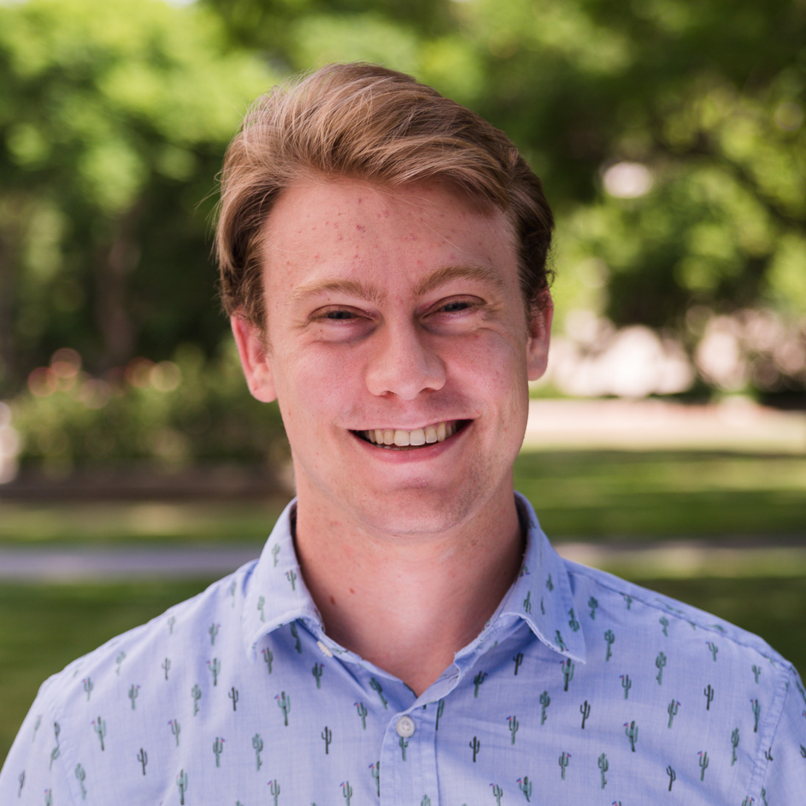   | **Alexander M. Dalzell**[^1] AWS Center for Quantum Computing, Pasadena, CA, USA                                                                                                                     |
| 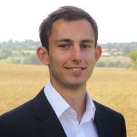         | **Sam McArdle**[^1] AWS Center for Quantum Computing, Pasadena, CA, USA                                                                                                                              |
|          | **Mario Berta** AWS Center for Quantum Computing, Pasadena, CA, USA Institute for Quantum Information, RWTH Aachen University, Aachen, Germany Imperial College London, London, UK           |
| 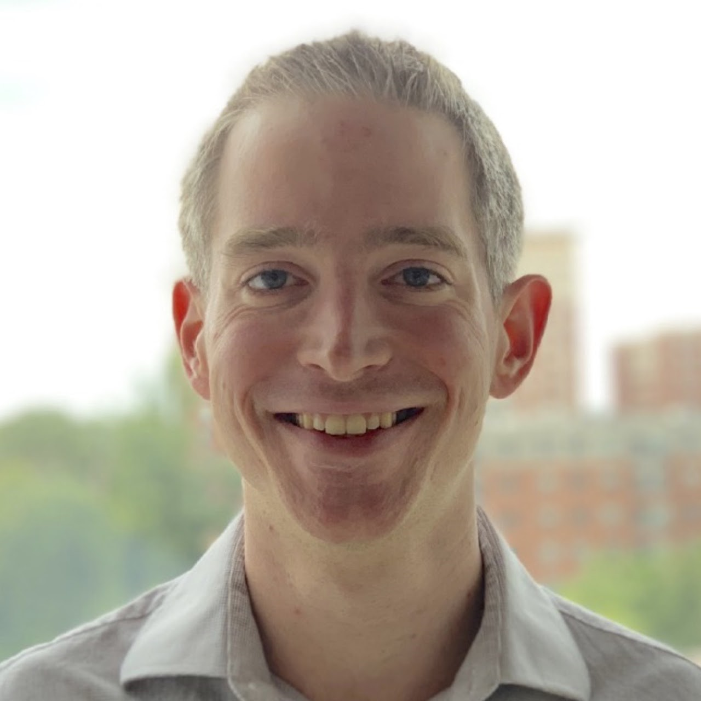  | **Przemyslaw Bienias** AWS Center for Quantum Computing, Pasadena, CA, USA                                                                                                                           |
| 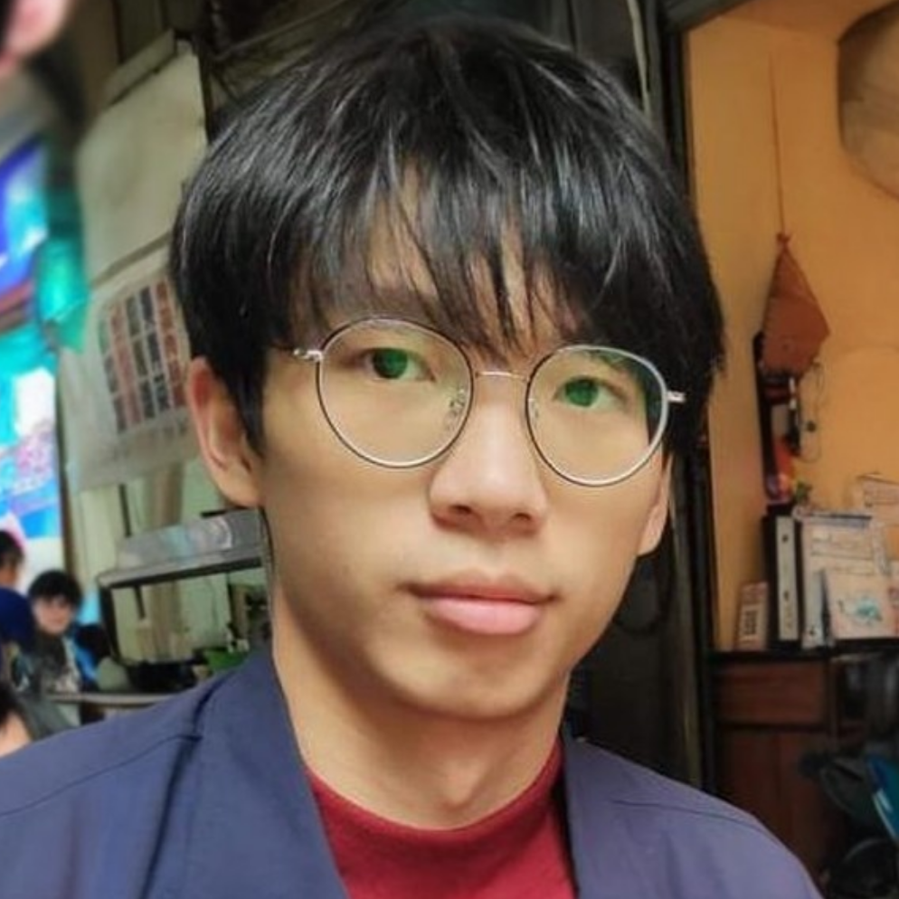            | **Chi-Fang Chen** AWS Center for Quantum Computing, Pasadena, CA, USA Institute for Quantum Information and Matter, Caltech, Pasadena, CA, USA                                                   |
| 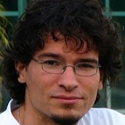       | **András Gilyén** Alfréd Rényi Institute of Mathematics, Budapest, Hungary                                                                                                                           |
| 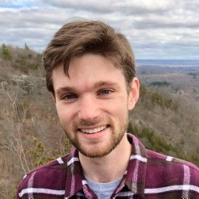         | **Connor T. Hann** AWS Center for Quantum Computing, Pasadena, CA, USA                                                                                                                               |
| 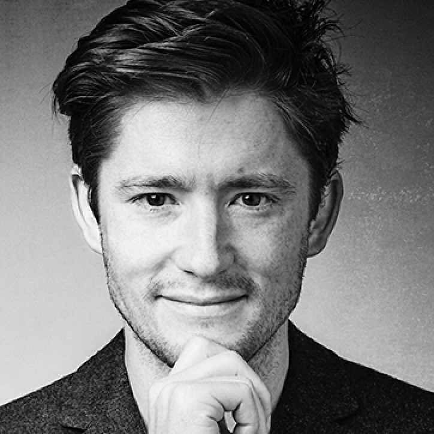 | **Michael J. Kastoryano** AWS Center for Quantum Computing, Pasadena, CA, USA IT University of Copenhagen, Copenhagen, Denmark                                                                   |
| 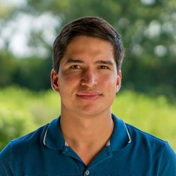  | **Emil T. Khabiboulline** AWS Center for Quantum Computing, Pasadena, CA, USA Department of Physics, Harvard University, Cambridge, MA, USA                                                      |
| 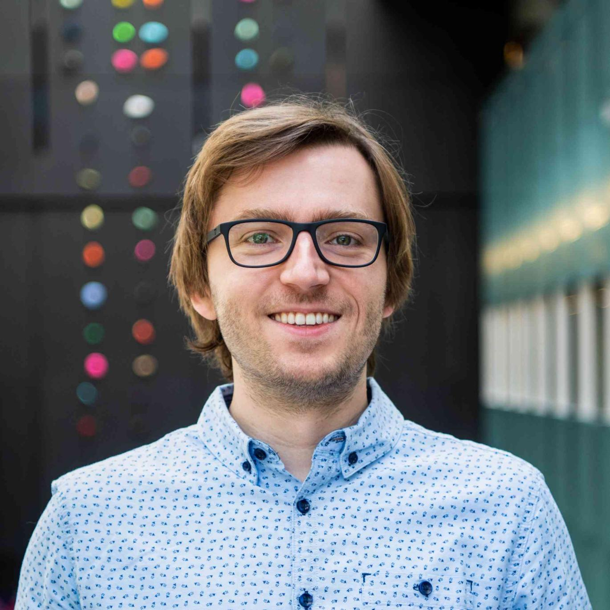   | **Aleksander Kubica** AWS Center for Quantum Computing, Pasadena, CA, USA                                                                                                                            |
| 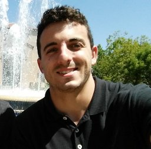        | **Grant Salton** AWS Center for Quantum Computing, Pasadena, CA, USA Institute for Quantum Information and Matter, Caltech, Pasadena, CA, USA Amazon Quantum Solutions Lab, Seattle, WA, USA |
| 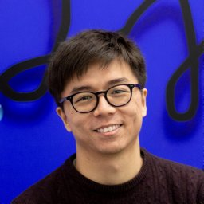         | **Samson Wang** AWS Center for Quantum Computing, Pasadena, CA, USA Imperial College London, London, UK                                                                                          |
| 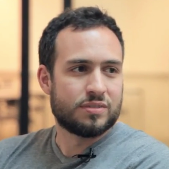            | **Fernando G. S. L. Brandão** AWS Center for Quantum Computing, Pasadena, CA, USA Institute for Quantum Information and Matter, Caltech, Pasadena, CA, USA                                       |

[^1]: These authors contributed equally. Corresponding emails:
    <dalzel@amazon.com>, <sammcard@amazon.com>
