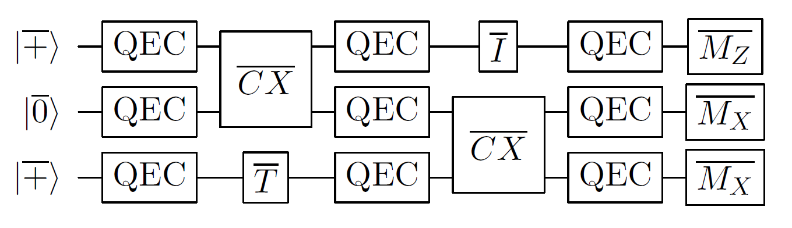

# Basics of fault tolerance

## Rough overview (in words)

The error rates of all known realizations of physical qubits and basic operations are too high to enable implementation of the majority of quantum algorithms considered in this survey. Even if the probability $p$ for each basic operation to malfunction was minute, we would nevertheless expect an error to occur in any quantum circuit comprising more than $\mathcal{O}\left( 1/p \right)$ operations. One may optimistically assume that in the foreseeable future $p= 10^{-6}$ might be achieved by certain quantum architectures, such as trapped ions [@bermudez2017trappedIonFaultTolerant; @bruzewicz2019trappedIonProgressChallenges]. This, in turn, limits the size of any quantum circuit that one may hope to reliably execute to roughly one million basic operations. Such a bound places a severe restriction on the algorithms that could be run and is orders of magnitude smaller than the resources needed to implement the quantum algorithms described in the other parts of this survey.

The theory of quantum fault tolerance [@shor1996FTQC] and quantum error correction [@shor1995SchemeReducingDecoherence; @steane1996ErrorCorrectingQuantum; @gottesman1996QECCodesSaturatingHammingBound] provides a collection of techniques to deal with imperfect operations and unavoidable noise afflicting the physical hardware, at the expense of moderately increased resource overheads. In the basic model for fault tolerance one assumes that each elementary component of a quantum circuit (including the identity gate) may fail with some small but nonzero probability, independently of the other components, and classical information processing is noiseless. For concreteness and simplicity, one may choose to model any noisy component as an ideal component followed by (or, in the case of measurements, preceded by) some Pauli channel acting on the same subset of qubits. Let $\mathcal C$ be a quantum circuit (possibly with classical input and output) describing a desired quantum algorithm. Since each component of $\mathcal C$ may fail, one should not implement $\mathcal C$ directly; rather, one needs to implement a different quantum circuit $\mathcal F(\mathcal C)$, which is fault-tolerant (FT) version of $\mathcal C$. This, in turn, can be achieved by replacing each qubit in $\mathcal C$ with a logical qubit encoded in some quantum error-correcting (QEC) code and each elementary component of $\mathcal C$ with a corresponding FT gadget; see Fig. [1](#fig:FTcircuits){reference-type="ref" reference="fig:FTcircuits"}. The desired quantum computation will then be realized on the logical level of $\mathcal F(\mathcal C)$ without leaving the protective encoding guaranteed by the QEC code.

{#fig:FTcircuits} 

<figure markdown>
  
  <figcaption markdown>
1(b): An FT realization of $\mathcal C$ is a quantum circuit $\mathcal F(\mathcal C)$ obtained by replacing each qubit in $\mathcal C$ with a logical qubit encoded in some QEC code and using appropriate FT gadgets interspersed with QEC gadgets in place of each basic component of $\mathcal C$. Note that some gadgets may require considerable resources (not shown in the picture); see [logical gates](../fault-tolerant-quantum-computation/logical-gates-with-the-surface-code.md#logical-gates-with-the-surface-code) and [QEC gadgets](../fault-tolerant-quantum-computation/quantum-error-correction-with-the-surface-code.md#quantum-error-correction-with-the-surface-code) with the surface code for more details. 
  </figcaption>
</figure>

To realize universal FT quantum computation, it suffices to have state preparation gadgets (for at least one type of state), measurement gadgets (for at least one type of measurement), gate gadgets (for a universal set of gates) and QEC gadgets. One requires that all these gadgets satisfy certain FT conditions; see, for instance, [@aliferis2006quantum; @gottesman2010introduction]. Although the asymptotic scaling of resource overheads associated with FT gadgets is manageable (for instance, polylogarithmic in the inverse of the target logical error rate), the constant prefactors tend to be large, resulting in the qubit and time overheads that currently constitute one of the main bottlenecks to practical FT quantum computation. We will discuss this point in more detail for the implementation of [logical gates](../fault-tolerant-quantum-computation/logical-gates-with-the-surface-code.md#logical-gates-with-the-surface-code) and [QEC gadgets](../fault-tolerant-quantum-computation/quantum-error-correction-with-the-surface-code.md#quantum-error-correction-with-the-surface-code) with the planar architecture based on the surface code [@kitaev1997FTQCanyons; @dennis2002TopologicalQuantumMemory].

## Rough overview (in math)

Designing FT gadgets is a challenging task for several reasons. First, FT gadgets are usually developed and optimized for a specific QEC code. Second, even though they comprise imperfect basic components, they are required to work reliably as long as a number of malfunctioning components is limited. Third, FT gadgets may spread errors, however they must not do so in an uncontrollable way.

Given a set of FT gadgets, one can reliably perform an arbitrarily long quantum computation as long as the physical error rate of each basic component is below some constant value, often referred to as the FT threshold. This result is established by the celebrated threshold theorem [@aharonov1997FTQCconstantError; @kitaev1997quantumComputationsAlgosQEC; @knill1998ResilientQC; @aliferis2006quantum]. To be more precise, consider the basic model for FT. The threshold theorem asserts that there exists a constant $p_\text{FT}>0$, such that for any $\epsilon>0$ and any quantum circuit $\mathcal C$ there exists a quantum circuit $\widetilde{\mathcal C}$ that produces an output with statistical distance at most $\epsilon$ from the output of $\mathcal C$, provided the physical error rate $p$ is below $p_\text{FT}$. Moreover, $\widetilde{\mathcal C}$ uses a number of qubits and timesteps that are at most $\mathrm{polylog}(|\mathcal C|/\epsilon)$ times bigger than the number of qubits and timesteps in $\mathcal C$, where $|\mathcal C|$ denotes the number of basic components in $\mathcal C$.

The basic idea behind the proof of the threshold theorem proceeds as follows. Consider a quantum circuit $\mathcal F(\mathcal C)$, which is an FT implementation of $\mathcal C$. Assuming the basic model for fault tolerance described above, for sufficiently small physical error rate $p$, the logical error rate for $\mathcal F(\mathcal C)$ should be smaller than $p$, since $\mathcal F(\mathcal C)$ is an FT implementation of $\mathcal C$. One can then consider a quantum circuit $\mathcal F\circ \mathcal F(\mathcal C)$, which is an FT implementation of $\mathcal F(\mathcal C)$, reducing the logical error rate even further. By repeating this process, one eventually obtains a quantum circuit $\widetilde{\mathcal C} = \mathcal F\circ\ldots \circ \mathcal F(\mathcal C)$ with the logical error rate below $\epsilon$. The resulting FT protocol is based on concatenated QEC codes.

One may improve the scaling of the resource overheads from the threshold theorem with concatenated QEC codes. In particular, in the asymptotic limit of large quantum circuits, the ratio of qubits in $\mathcal C$ and $\widetilde{\mathcal C}$ can be a constant [@gottesman2014FTQCconstantOverhead]. In this construction, the FT protocol requires a family of QEC codes that satisfies certain properties, including the desired scaling of code parameters, computationally efficient decoding algorithms and constant-weight parity checks. Such a family of QEC codes was first provided in [@fawzi2018ConstantOverheadExpanderCode].

## Dominant resource cost (gates/qubits)

At the heart of FT quantum computation, there is usually some QEC code. Since the choice of a QEC code affects the resource overheads, we would like to choose one for which the encoding rate (defined as the ratio $k/n$, where $k$ and $n$ are the number of logical and physical qubits, respectively) as well as the relative code distance (defined as the ratio $d/n$, where $d$ is the minimum weight of any nontrivial logical operator) are as high as possible. Although for concatenated QEC codes (that feature in the threshold theorem), both $k/n$ and $d/n$ go to zero as $n$ goes to infinity, we know that there exist QEC codes with good parameters, i.e, for which $k/n$ and $d/n$ are asymptotically constant [@calderbank1996GoodQECCodes]. Moreover, recent groundbreaking results [@breuckmann2021balancedProductQuantumCodes; @panteleev2022GoodLDPC; @dinur2022LocallyTestable; @leverrier2022QuantumTannerCodes] provided constructions of QEC codes that not only have good parameters but also constant-weight parity checks (thus their name—quantum low-density parity check codes). The latter property is particularly important from the perspective of fault tolerance. However, experimental realization of these constructions (in contrast to [the surface code](../fault-tolerant-quantum-computation/quantum-error-correction-with-the-surface-code.md#quantum-error-correction-with-the-surface-code)) seems extremely challenging, at least within the realm of solid-state qubits constrained by geometric locality of their physical entangling gates.

Another aspect of FT quantum computation that affects the resource overheads are the FT gadgets that are being used. One of the easiest ways to implement FT gadgets for gates is via transversal gates. By definition, transversal gates are implemented via a tensor product of single-qubit unitaries (or, more generally, via a depth-one quantum circuit) and therefore do not spread errors in an uncontrollable way. Unfortunately, transversal gates are limited by the Eastin–Knill theorem [@eastin2009RestrictionsTransversal; @zeng2011Transversality; @jochymOConnor2018Disjointness; @kubica2021QuantumMetrologicalBounds], which rules out the existence of a (finite-dimensional) QEC code with a universal set of transversal logical gates. One strategy to circumvent this limitation is to prepare certain magic states and use them to realize FT gates [@bravyi2005UniversalQC]; see the section on [implementing logical gates](../fault-tolerant-quantum-computation/logical-gates-with-the-surface-code.md#logical-gates-with-the-surface-code) for more details and a discussion of other strategies.

To realize FT gadgets for state preparation, QEC, and measurement, one typically chooses among three standard FT schemes: Shor's [@shor1996FTQC], Steane's [@steane1997ActiveStabilization], or Knill's [@knill2005QCwithNoisyDevices]. Roughly speaking, Shor's scheme uses simple states (verified cat states) of the ancilla qubits at the expense of implementing many gates on the data qubits, whereas Steane's and Knill's schemes trade highly complex states of the ancilla qubits (logical states encoded in the underlying QEC code) for minimizing the number of gates on the data qubits. To determine the best choice, one needs to consider the underlying QEC code (e.g., Steane's scheme is applicable only to CSS codes [@calderbank1996GoodQECCodes; @steane1996ErrorCorrectingQuantum]) and the quantum hardware restrictions (e.g., lack of extra ancilla qubits). For an illuminating and detailed discussion of FT schemes, see, e.g., [@gottesman2010introduction]. We remark that for QEC codes with additional structure, such as quantum low-density parity check codes, one may pursue different approaches toward FT quantum computation; see the section on [QEC with the surface code](../fault-tolerant-quantum-computation/quantum-error-correction-with-the-surface-code.md#quantum-error-correction-with-the-surface-code).

## Caveats

Rigorous proofs provide lower bounds on the FT threshold $p_\text{FT}$. For instance, for an FT scheme based on the $7$-qubit code, one finds $p_\text{FT} > 2.73\times 10^{-5}$ [@aliferis2006quantum]. For an FT scheme by Knill [@knill2005QCwithNoisyDevices] that relies on complex ancilla preparation techniques, one finds $p_\text{FT} > 1.04\times 10^{-3}$ [@aliferis2008AccuracyThresholdPostselected]. However, these values can differ by orders of magnitude from the values estimated in numerical simulations. For instance, the FT scheme by Knill is estimated to have an FT threshold $p_\text{FT}$ as high as $5\times 10^{-2}$, constituting one of the highest known FT thresholds. We remark that these values depend sensitively on the details of the FT schemes and the assumptions about noise. In particular, to obtain the aforementioned values we assume the ability to implement gates between any qubits. On the other hand, if we arrange qubits on some geometric lattice and restrict gates to be local, then FT thresholds still exist, however their values are significantly reduced.

One can expand the threshold theorem in many ways. Even using the basic model for fault tolerance, one may choose the failure probabilities for each elementary component of a quantum circuit differently, e.g., the failure probability of a measurement to be ten times higher than that of a gate. One can consider more general noise (which includes systematic errors, such as overrotations) arising due to a weak interaction between the system and a non-Markovian environment [@aliferis2006quantum; @terhal2005FTQCnonMarkovian]. In general, although experimental realizations of quantum computation may not satisfy exactly the assumptions of the threshold theorem, we expect the main conclusions to hold as long as the assumptions are not violated too much.

To simplify the analysis of FT schemes, we often assume unlimited classical computational power that one needs to, e.g., process the error syndrome and infer an appropriate recovery operator in a QEC gadget; a number of such decoding algorithms have been developed for [QEC with the surface code](../fault-tolerant-quantum-computation/quantum-error-correction-with-the-surface-code.md#quantum-error-correction-with-the-surface-code). It is important not to abuse this assumption by, for instance, solving the initial problem with an inefficient classical algorithm. At some point, however, one needs to take into account the finite speed of classical information processing. If the classical unit that processes the error syndrome is unable to keep pace with the rate at which this syndrome is being produced, then the error syndrome will start to accumulate and one will suffer from the so-called backlog problem [@terhal2015QECforQuantumMemories]. Subsequently, the speed of quantum computing will be exponentially reduced and the computational advantage of quantum computing will be annulled. This issue will be especially prominent for polynomial speedup quantum algorithms.

## Further reading

- An accessible introduction to quantum error correction and the theory of fault tolerance can be found in [@raussendorf2012KeyIdeasQEC].
- A detailed introduction to quantum error correction and fault-tolerant quantum computation can be found in [@gottesman2010introduction].
- A fairly recent perspective on roads towards fault-tolerant universal quantum computation can be found in [@campbell2017RoadsTowardFTQC].
- The [error correction zoo](https://errorcorrectionzoo.org/) provides a useful compilation of error correcting codes. 

