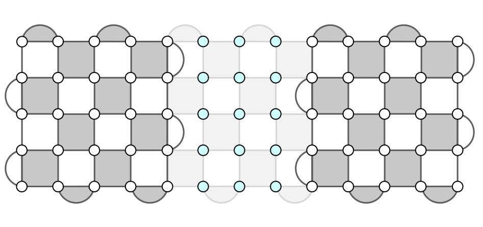
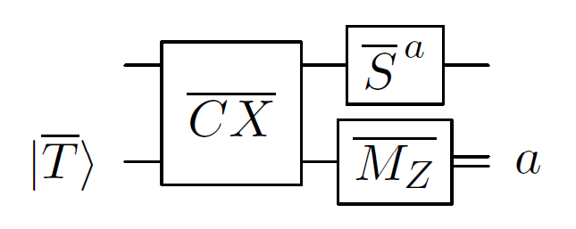
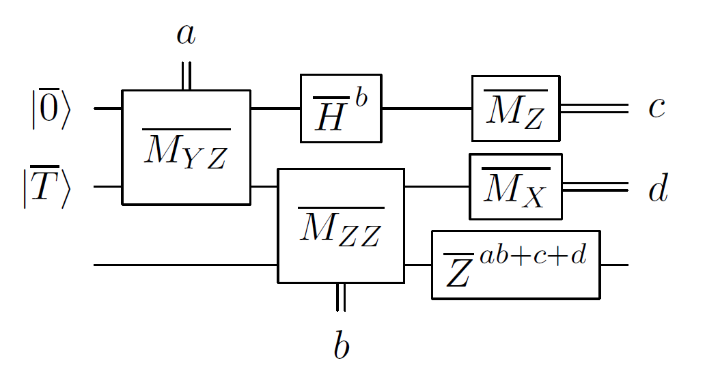

# Logical gates with the surface code

## Rough overview (in words)

The ability to implement an arbitrary unitary operation, either exactly or approximately, is a prerequisite for performing quantum computation. It can be achieved with unitary gates that form a universal gate set [@kitaev1997quantumComputationsAlgosQEC; @nielsen2002QCQI]. A commonly considered gate set contains two Clifford gates, the Hadamard gate $H$ and the controlled-$X$ gate $CX$ (also known as the controlled NOT gate), and one non-Clifford gate, the $T = Z^{1/4}$ gate. One can consider other non-Clifford gates, such as the Toffoli gate $CCX$. Note that non-Clifford gates are essential for quantum computation, as any quantum circuit comprising only Clifford gates, state preparation, and measurement in the computational basis can be simulated in polynomial time on a probabilistic classical computer [@gottesman1998HeisenbergRepresentation; @aaronson2004improvedSimulationStabilizer].

Since we are interested in fault-tolerant quantum computation, we would like to implement a universal set of logical gates $\overline H$, $\overline{CX}$, and $\overline T$ on information encoded in some QEC code, such as [the surface code](../fault-tolerant-quantum-computation/quantum-error-correction-with-the-surface-code.md#quantum-error-correction-with-the-surface-code). We can implement these gates with a planar layout of qubits and nearest-neighbor entangling gates. To be more precise, we consider a simple architecture [@horsman2012latticeSurgery] that comprises $N$ surface code patches, each encoding a logical qubit into the surface code with code distance $d$, and the routing space in between; see Fig. [1](#fig:planar){reference-type="ref" reference="fig:planar"}(a). In such an architecture, the total number of data and ancilla qubits is $\mathcal O(N d^2)$.

<figure markdown> {#fig:planar}

<figcaption markdown>Figure 1(a): A planar layout of qubits comprises surface code patches (shaded), each using the layout depicted in [Quantum error correction with the surface code](../fault-tolerant-quantum-computation/quantum-error-correction-with-the-surface-code.md#quantum-error-correction-with-the-surface-code) Fig. [1](../fault-tolerant-quantum-computation/quantum-error-correction-with-the-surface-code.md#fig:surface_code)(a) and encoding a logical qubit, and the routing space in between.</figcaption> </figure>

<figure markdown> 
<figcaption markdown>Figure 1(b): Logical Pauli measurement $\overline{M_{XX}}$ is implemented by preparing the routing space qubits (turquoise dots) in the state $\ket 0$ and repeatedly measuring parity checks (lightly shaded) in the routing space spanning between the two surface code patches. Other logical Pauli measurements, e.g., $\overline{M_{ZZ}}$ and $\overline{M_{YZ}}$, require connecting different boundaries of the two patches. </figcaption> </figure>

## Rough overview (in math)

The logical $\overline H$ does not pose any challenges. From a practical standpoint, it is transversal, since it can be realized by applying the Hadamard gate $H$ to every data qubit in the surface code patch, followed by swapping of the roles of Pauli $Z$- and $X$-type parity checks in the subsequent QEC rounds. As such, the logical $\overline H$ takes constant time and the surface code patch is effectively rotated (which may alter how subsequent operations are implemented).

The logical $\overline{CX}$ is more challenging than the logical $\overline H$, since it is impossible to implement it transversally with the planar layout of qubits and nearest-neighbor entangling gates shown in Fig. [1](#fig:planar){reference-type="ref" reference="fig:planar"}(a). Instead, one can use the following quantum circuit, where the first qubit (top wire) is the control and the third qubit (bottom wire) is the target of the logical $\overline{CX}$ gate 
{#fig:qcirc_b}
It is straightforward to fault-tolerantly realize preparation of the logical state $\ket{\overline{+}}$, logical Pauli measurement $\overline{M_Z}$, and logical Pauli operators $\overline{Z}$ and $\overline{X}$. In addition, the required logical Pauli measurements $\overline{M_{ZZ}}$ and $\overline{M_{XX}}$ can be implemented fault-tolerantly via "lattice surgery" techniques [@horsman2012latticeSurgery]; see Fig. [1](#fig:planar){reference-type="ref" reference="fig:planar"}(b) for an illustration of how to realize $\overline{M_{XX}}$. Unlike the logical $\overline H$, logical Pauli measurements $\overline{M_{ZZ}}$ and $\overline{M_{XX}}$ and, subsequently, the logical $\overline{CX}$ cannot be realized in constant time; rather, due to the need to account for measurement errors, they typically incur time overhead of $\mathcal{O}\left( d \right)$.

The logical $\overline T$ can be implemented using gate teleportation [@gottesman1999viabilityUniversalQC] via the following quantum circuit 
{#eq:gate_teleportation} 
where the logical resource state $\ket{\overline{T}} = \left(\ket{\overline{0}} + e^{i\pi/4}\ket{\overline{1}}\right)/\sqrt{2}$, the logical gate $\overline{S} = \overline{Z}^{\,1/2}$, and the first qubit (top wire) is the control and the second qubit (bottom wire) is the target of the logical $\overline{CX}$ gate. Even though the logical $\overline{S}$ is a Clifford gate, its fault-tolerant implementation with the surface code may not be effortless [@brown2017pokingHoles] (unless one uses nonlocal entangling gates [@kubica2015unfoldingColorCode; @moussa2016transversalCliffordGates]) Moreover, the need to apply the logical $\overline{S}$ conditioned on the measurement outcome of $\overline{M_Z}$ may slow down quantum computation. For that reason, it may be beneficial to use the following quantum circuit from [@litinski2019gameofsurfacecodes Fig. 17(b)] 
{#eq:autocorrected}
which is an alternative to the one in Fig. [2](#eq:gate_teleportation) that uses one additional logical qubit but requires only logical Pauli corrections, rather than logical Clifford corrections. In either case, given the logical resource state $\ket{\overline T}$, the logical $\overline T$ typically incurs time overhead of $\mathcal{O}\left( d \right)$. We conclude that implementing the logical $\overline T$ reduces to the problem of preparing the logical state $\ket{\overline{T}}$, which, in turn, can be realized via state distillation [@knill2004FTPostSelectedQC; @bravyi2005UniversalQC]; see [@beverland2021costUniversality] for a brief overview of state distillation.

## Dominant resource cost (gates/qubits)

State distillation provides a fault-tolerant method to prepare high-fidelity logical resource states, such as the logical state $\ket{\overline T}$. The basic idea is to convert some number of noisy resource states into fewer but, crucially, less noisy resource states. Importantly, this task can be accomplished with quantum circuits comprising only Clifford gates (together with state preparation and measurement in the computational basis) and postselection. Typically, state distillation circuits are based on some QEC code, e.g., the 15-qubit Reed–Muller code.

State distillation is often described as a resource-intensive method that contributes the most to the resource overhead of fault-tolerant quantum computation with the surface code [@fowler2012SurfaceCodes] and, for that reason, many efforts have been devoted to finding possible alternatives [@bravyi2015doubledColorCodes; @jochymOConnor2016stackedCodes; @bombin20182DquantumComputation; @chamberland2019faultTolerantMagicStateFlagQubits; @beverland2021costUniversality]. However, recent results indicate that state distillation may not be as costly as one may think [@litinski2019gameofsurfacecodes; @litinski2019magicstate], especially when one optimizes it for specific quantum hardware and noise that exhibits some bias [@litinski2022activeVolume]. In the task of estimating the ground state energy density of the [Fermi–Hubbard model](../areas-of-application/condensed-matter-physics/fermi-hubbard-model.md#fermihubbard-model), state distillation of logical Toffoli resource states injected one at a time uses less than $10\%$ of the total resources and is never a bottleneck on runtime of the quantum algorithm [@chamberland2022buildingFTQC].

Oftentimes, a quantum algorithm is expressed as a quantum circuit $\mathcal C$ comprising Clifford and $T$ gates. Thus, by using the aforementioned logical gates $\overline H$, $\overline{CX}$, and $\overline{T}$, we can fault-tolerantly implement the logical quantum circuit $\overline{\mathcal C}$ with the surface code of code distance $d$ and a planar layout of qubits in Fig. [1](#fig:planar){reference-type="ref" reference="fig:planar"}(a). However, from the perspective of reducing the resource overheads, it may be beneficial to consider a quantum circuit $\mathcal C'$ equivalent to the circuit $\mathcal C$, which is obtained from $\mathcal C$ by commuting all Clifford gates to the end of $\mathcal C$ [@litinski2019gameofsurfacecodes]. As a result, the circuit $\mathcal C'$ only comprises multiqubit Pauli $\pi/8$ rotations (which are a generalization of the $T$ gate and can be realized via, e.g., quantum circuits analogous to the one in Fig. [3](#eq:autocorrected). Consequently, fault-tolerant implementation of the logical circuit $\overline{\mathcal{C}'}$ incurs the qubit overhead of $\mathcal{O}\left( Nd^2 \right)$ and time overhead of $\mathcal{O}\left( Md \right)$, where $N$ and $M$ are the number of, respectively, qubits and $T$ gates in $\mathcal C$. We remark that the time overhead can be reduced at the expense of increased qubit overhead—first by distilling more resource states and being able to use them faster, then by implementing them in parallel [@litinski2019gameofsurfacecodes].

## Caveats

Lattice surgery is not necessary to realize fault-tolerant quantum computation with a planar layout of qubits and nearest-neighbor gates. An alternative approach (which actually preceded the development of lattice surgery) relies on the surface code with defects and braiding [@raussendorf2007FTQChighThreshold; @raussendorf2007topologicalFaultTolerance; @fowler2012SurfaceCodes; @brown2017pokingHoles]. However, resource overhead estimates strongly suggest that this approach is not competitive with lattice surgery [@fowler2018].

A simple architecture depicted in Fig. [1](#fig:planar){reference-type="ref" reference="fig:planar"}(a) can be improved in a couple ways to reduce the qubit overhead. First, it is possible to pack surface code patches more densely, resulting in more logical qubits for the given total number of qubits and target code distance [@lao2018mappingLatticeSurgery; @litinski2019gameofsurfacecodes] Second, one can designate certain regions, commonly referred to as magic state factories, to solely produce resource states, such as the logical state $\ket{\overline T}$, and optimize their design [@OGorman2017magicStateFactories; @litinski2019gameofsurfacecodes; @litinski2019magicstate].

To simplify implementation of logical gates, one can consider other QEC codes, e.g., the three-dimensional color code [@bombin2015gaugeColorCodes; @kubica2015universalTransversalGates]. The gauge color code has redundant degrees of freedom, commonly referred to as gauge qubits. For different states of its gauge qubits, the gauge color code admits transversal implementation of different logical gates, which, *combined*, form a universal gate set (thus circumventing the Eastin–Knill theorem [@eastin2009RestrictionsTransversal; @zeng2011Transversality]). Importantly, changing the state of gauge qubits can be done fault-tolerantly in constant time. However, to realize this construction one needs, for instance, a three-dimensional layout of qubits with nearest-neighbor gates or a planar layout of qubits with a limited number of nonlocal gates, which are more challenging to engineer compared to the simple architecture in Fig. [1](#fig:planar){reference-type="ref" reference="fig:planar"}(a). To achieve code distance $d$ with the gauge color code one incurs qubit overhead of $\mathcal{O}\left( d^3 \right)$ (compared to qubit overhead of $\mathcal{O}\left( d^2 \right)$ for the surface code), so, similarly to single-shot QEC described in [Quantum error correction with the surface code](../fault-tolerant-quantum-computation/quantum-error-correction-with-the-surface-code.md#quantum-error-correction-with-the-surface-code){reference-type="ref" reference="prim:QEC"}, this approach trades time overhead for qubit overhead.

## Example use cases

- Lattice surgery techniques developed for the surface code can be straightforwardly adapted to, e.g., the color code [@landahl2014colorCodeLatticeSurgery] or the surface code with a twist [@yoder2017surfaceCodeTwist], leading to fault-tolerant quantum computation with potentially reduced qubit overhead. In addition, lattice surgery techniques can also be used for the fault-tolerant transfer of encoded information between arbitrary topological quantum codes [@poulsenNautrup2017faultTolerantInterface].
- Now, we are ready to present a rough, order-of-magnitude estimate of the resource overheads needed to realize fault-tolerant quantum computation in the architecture based on the surface code and lattice surgery. For concreteness, we consider the circuit noise of strength $p=0.001$, where each basic operation, including state preparation, CNOT gate, and measurement, can fail with probability $p$. Assume that we want to implement a quantum circuit $\mathcal C$ comprising $N=10^3$ qubits and a certain number $M=10^{10}$ of $T$ gates. These resource counts are in the ballpark of estimates for various quantum algorithms in the application areas of [quantum chemistry](../areas-of-application/quantum-chemistry/introduction.md#quantum-chemistry), hyperref\[appl:CondensedMatter\]condensed matter physics, and [cryptanalysis](../areas-of-application/cryptanalysis/introduction.md#cryptanalysis). First, following the procedure from [@litinski2019gameofsurfacecodes], we compile $\mathcal C$ into a new circuit $\mathcal C'$ of depth $M$ that comprises $N$ qubits and $M$ multiqubit Pauli $\pi/8$-rotations implemented one at a time. Since there are $NM$ possible fault locations in the circuit $\mathcal C'$, the error rate for each qubit of $\mathcal C'$ should not exceed than $$\begin{equation} \epsilon \approx 1/(N M). \end{equation}$$ Since each qubit of $\mathcal C'$ is realized as a logical qubit of the surface code with distance $d$, then its logical error rate $p_\text{fail}$ can be approximated by $$\begin{equation} p_\text{fail} \approx \alpha (p/p_\text{th})^{d/2}, \end{equation}$$ where we can crudely set $\alpha = 0.05$ and $p_\text{th} = 0.01$; see [quantum error correction with the surface code](../fault-tolerant-quantum-computation/quantum-error-correction-with-the-surface-code.md#quantum-error-correction-with-the-surface-code) for more details. Note that these values are empirical and depend heavily on the choice of the decoder; in our case—the belief-matching algorithm [@higgott2023improvedDecodingCircuitNoise]. Thus, in order for the logical error rate $p_\text{fail}$ to reach the target error rate $\epsilon$ we need the surface code distance at least $$\begin{equation} d \approx \left\lceil 2 \log(\alpha N M)/\log(p_\mathrm{th}/p) \right\rceil. \end{equation}$$ Assuming that half of all required qubits is devoted to realizing $N$ surface code patches (each comprising $2d^2-1$ data and ancilla qubits), with the other half used for resource state distillation and routing, we obtain that the fault-tolerant implementation of $\mathcal C'$ incurs qubit overhead of $$\begin{equation} n_{\mathcal C'} \approx 4Nd^2 \end{equation}$$ and time overhead of $$\begin{equation} t_{\mathcal C'} \approx Md\tau, \end{equation}$$ where we crudely set $\tau = 1\ \!\mu s$ to be the time needed to implement one syndrome measurement round with the superconducting circuits architecture. Finally, our order-of-magnitude resource estimate gives $2.3\times 10^6$ physical qubits and $67$ hours of runtime. This general approach to resource estimation has been applied to a number of specific quantum algorithms in a variety of [application areas](../areas-of-application/introduction.md#areas-of-application); see, e.g., [@lee2021EvenMoreEfficientChemistryTensorHyp; @gidney2021HowToFactor; @Kivlichan2020ImprovedFaultTolerantSimulationCondensedMatter; @Beverland2022Requirements; @sanders2020FTQCforCombOpt]. These references often go beyond a back-of-the-envelope calculation and provide a more meticulous analysis that accounts for exact qubit layouts and the physical footprint of resource state distillation factories. They also pursue optimizations to how the circuit is implemented (e.g. exploiting space-time tradeoffs) in light of these considerations.

## Further reading

- An accessible overview of fault-tolerant quantum computation based on the surface code and lattice surgery can be found in [@litinski2019gameofsurfacecodes].
- A convenient way to describe and optimize lattice surgery operations is via the ZX calculus, which is a diagrammatic language for quantum computing [@coecke2017picturingQuantumProcesses; @deBeaudrap2020ZXcalculusLatticeSurgery].
- A direct comparison of the resource overhead associated with preparation of the logical resource state $\ket{\overline T}$ using either state distillation or transversal gates (with the three-dimensional color code) can be found in [@beverland2021costUniversality].
- To read about a framework for estimating resources required to realize large-scale fault-tolerant quantum computation, see [@Beverland2022Requirements]. 

