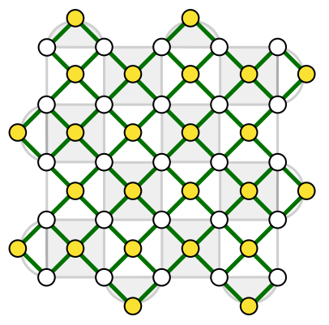
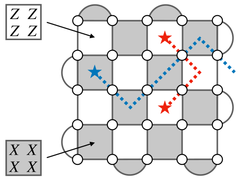

# Quantum error correction with the surface code

## Rough overview (in words)

To protect quantum information from detrimental effects of noise, we can encode it into a code space of some quantum error correcting (QEC) code [@shor1995SchemeReducingDecoherence; @steane1996ErrorCorrectingQuantum]. Oftentimes, we choose to work with stabilizer codes [@gottesman1996QECCodesSaturatingHammingBound]. By definition, a code space of a stabilizer code is the simultaneous $(+1)$-eigenspace of a set of commuting Pauli operators, commonly referred to as parity checks.

The surface code [@kitaev1997FTQCanyons; @bravyi1998quantumCodesLattice; @dennis2002TopologicalQuantumMemory] is one of the most-studied stabilizer codes. It can be implemented with a planar layout of qubits and entangling gates only between neighboring qubits. For that reason, the surface code is particularly appealing for quantum hardware architectures with restricted qubit layout and connectivity, such as superconducting circuits [@devoret2013superconductingCircuits; @blais2021circuitQuantumElectrodynamics]. The most common realization of the surface code uses $n = L^2$ data qubits to encode $k=1$ logical qubit and has code distance $d=L$, where $L$ is the linear size of the $L\times L$ square lattice with open boundary conditions. Additionally, $n_A = L^2 -1$ ancilla qubits are used to measure parity checks; see Figure [1](#fig:surface_code){reference-type="ref" reference="fig:surface_code"}(a).

<figure markdown> {#fig:surface_code}

<figcaption markdown>Figure 1(a): A planar layout of data and ancilla qubits (white and yellow dots, respectively) with entangling gates (green edges) only between neighboring qubits. This layout gives rise to the $L\times L$ square lattice with open boundary conditions, where $L=5$ here.</figcaption> </figure>

<figure markdown> 

<figcaption markdown>Figure 1(b): The surface code can be realized by measuring Pauli $Z$- and $X$-type parity checks (light and dark faces, respectively). The error syndrome (red and blue stars) can be interpreted as the endpoints of string-like Pauli $X$ and $Z$ errors (red and blue dashed edges, respectively). </figcaption> </figure>

In order to perform QEC, we have to be able to detect errors without revealing the encoded information. For stabilizer codes, we can achieve that by measuring their parity checks to obtain the error syndrome (which comprises the measurement outcomes returning $-1$). Then, the error syndrome is processed by specialized classical algorithms, also known as "decoders," to find an appropriate recovery operator that attempts to remove errors afflicting the encoded information. For generic stabilizer codes, the problem of optimal decoding is computationally hard, even for simple noise models [@iyer2015hardnessDecoding]. However, for QEC codes with some underlying structure, such as the surface code, there exist a variety of computationally efficient (albeit not optimal) decoding algorithms. In particular, the three most popular classes of decoders for the surface code are as follows.

- Matching decoders, including the minimum-weight perfect matching algorithm [@dennis2002TopologicalQuantumMemory] and its follow-up improvements, such as the belief-matching algorithm [@higgott2023improvedDecodingCircuitNoise]. These decoders phrase the problem of surface code decoding as a graph-theoretic problem of perfect matching, which can be efficiently solved [@edmonds1965pathsTreesFlowers].
- Clustering decoders, such as the renormalization-group decoder [@duclosCianci2010fastDecoders; @anwar2014fastDecoders] and the union-find decoder [@delfosse2021almostLinearTimeDecoding]. These decoders primarily exploit the structure of the error syndrome in the surface code; see Fig. [1](#fig:surface_code){reference-type="ref" reference="fig:surface_code"}(b).
- Tensor-network decoders [@bravyi2014efficientAlgorithmsMaxLikelihood; @darmawan2017tensorNetworkSurfaceCode; @chubb2021tensorNetworkDecoding]. These decoders phrase the the problem of surface code decoding as a numerical problem of contracting tensor networks.

In order to assess the usefulness of decoders, one usually considers two criteria: runtime and performance. The first criterion, runtime, is defined as the time needed for the decoder to process the error syndrome. It is crucial that any practical decoder is able to operate at the rate compatible with the rate of parity check measurements; otherwise, the error syndrome will start to accumulate, leading to the backlog problem [@terhal2015QECforQuantumMemories]. The second criterion, performance, is typically defined for a given noise model in terms of the logical error rate, i.e., the failure rate of the decoder to successfully undo the effects of noise on the encoded information. From the perspective of reducing runtime and improving performance, matching and clustering decoders stand out. Namely, they can achieve almost-linear runtime [@higgott2023sparseBlossom; @delfosse2021almostLinearTimeDecoding], and their performance is close to optimal. To achieve optimal performance, one can use tensor-network decoders, however they are often not computationally efficient, with runtime that scales unfavorably.

## Rough overview (in math)

In addition to being compatible with planar layouts of qubits and admitting computationally efficient decoders with good performance, the surface code also exhibits one of the highest QEC thresholds. Recall that a QEC threshold is specified for the following triple: a QEC code family of growing distance $d$, a decoder and noise model. It is defined as the highest value $p_\text{th}$ such that for any error rate $p< p_\text{th}$ the probability that the decoder fails to undo the effects of noise goes to zero as $d$ goes to infinity. For example, the QEC threshold for the surface code, using minimum-weight perfect matching algorithm, with a circuit noise model based on depolarizing noise, is around $1\%$ [@wang2011surfaceCodeErrorRates; @higgott2023improvedDecodingCircuitNoise].

Typically, if the error rate $p$ describing noise is sufficiently low and below the threshold $p_\mathrm{th}$, then the logical error rate $p_\mathrm{fail}$ scales as follows $$\begin{equation} p_\mathrm{fail} \sim \left(\frac{p}{p_\mathrm{th}}\right)^{\left\lceil \frac{d}{2}\right\rceil}. \end{equation}$$ This implies that in order to achieve the target error rate $\epsilon$, it suffices to implement the surface code with code distance $d = \mathcal{O}\left( \log(1/\epsilon) / \log(p_\text{th}/p) \right)$ using $n + n_A = \mathcal{O}\left( d^2 \right) = \mathcal{O}\left( \log^2(1/\epsilon) / \log^2(p_\text{th}/p) \right)$ data and ancilla qubits. Subsequently, qubit overhead associated with QEC based on the surface code only scales polylogarithmically in the inverse target error rate $1/\epsilon$.

## Dominant resource cost (gates/qubits)

Performing reliable QEC in the presence of measurement errors becomes challenging since the error syndrome can be corrupted. A straightforward solution to the problem of unreliable error syndrome is to repeatedly measure the parity checks in order to gain enough confidence in their measurement outcomes [@shor1996FTQC; @dennis2002TopologicalQuantumMemory]. If this approach is applied to the surface code with code distance $d$, then one needs to perform $\mathcal{O}\left( d \right)$ rounds of parity check measurements, incurring relatively large time overhead.

To reduce time overhead, one can pursue single-shot QEC [@bombin2015SingleShotFTQEC], which does not require repeated measurement rounds. It is possible to realize single-shot QEC with the surface code [@campbell2019theorySingleShot; @ashikhmin2020quantumDataSyndromeCodes; @delfosse2022beyondSingleShotFTQC], however, in addition to parity checks in Fig. [1](#fig:surface_code){reference-type="ref" reference="fig:surface_code"}(b), one would need to measure nonlocal high-weight parity checks, which is a serious limitation. A more streamlined approach is to consider a different realization of the surface code, the three-dimensional subsystem toric code [@kubica2022singleShotQECtoric; @bridgeman2023liftingTopologicalCodes], which can be implemented with qubits arranged on the cubic lattice and local low-weight parity checks. Although this approach is natively defined in three spatial dimensions, it can be emulated with planar layouts of qubits and either a limited number of nonlocal gates or the ability to reshuffle qubits (which is available with, e.g., Rydberg atoms [@saffman2010quantumInfoRydberg; @browaeys2020manyBodyRydberg]). In order to realize code distance $d$ one incurs qubit overhead of $\mathcal{O}\left( d^3 \right)$ (compared to qubit overhead of $\mathcal{O}\left( d^2 \right)$ for the surface code). From that perspective, single-shot QEC with the subsystem toric code can be viewed as trading time overhead for qubit overhead.

## Caveats

There have been efforts to improve surface code decoders by incorporating various machine learning methods, including neural networks [@torlai2017neuralDecoder; @maskara2019advantagesNeuralNetworkDecoding; @chamberland2022techniquesLocalGlobalDecoders] and reinforcement learning [@sweke2021reinforcementLearningDecoders]. At the current stage, decoders solely based on machine learning methods seem to be of limited applicability, mostly due to high training costs and scalability issues. Nevertheless, these approaches are likely to be immensely beneficial for QEC in the settings where (possibly correlated) noise is unknown and may have to be learned first.

Typically, in QEC analysis one considers simple Pauli noise, such as depolarizing noise acting independently and identically on each qubit. If noise exhibits bias between the $X$, $Y$, and $Z$ components of Pauli noise, then this structure can be exploited, leading to dramatically increased QEC thresholds, as exemplified by variants of the surface code [@tuckett2018ultrahighErrorThreshold; @bonillaAtaides2021XZZXsurfaceCode; @dua2022cliffordDeformed]. Similarly, noise that is biased toward erasure errors can be beneficial from the perspective of QEC [@stace2009thresholdsTopologicalCodes; @wu2022erasureConversion; @kubica2022erasure]. On the other hand, realistic noise may be coherent or correlated and thus not only difficult to correct, but also to numerically simulate. For instance, the logical error rates for coherent noise may be orders of magnitude higher than the estimates of the logical error rates for simple Pauli noise (assuming both types of noise have the same error rate) [@iyer2018smallQCneeded].

In addition to the three-dimensional subsystem toric code, one can also consider other higher-dimensional versions of the surface code. With these codes, roughly speaking, one improves the QEC capabilities at the expense of increased qubit overhead. Moreover, for the higher-dimensional surface code, it may suffice to use arguably the least complex decoders that are based on cellular automata (which, by definition, are parallelizable and only use local information about the error syndrome) [@dennis2002TopologicalQuantumMemory; @breuckmann2017localDecoders; @kubica2019cellularAutomatonDecoders; @vasmer2021cellularAtomatonDecoders].

## Example use cases

- Decoders for the surface code can be used for other QEC code families, such as the color code [@bombin2006topologicalQuantumDistillation; @bombin2007exactTopologicalQuantumOrder; @kubica2018phdThesis]. In fact, due to a close connection between the color codes and the surface codes [@bombin2012universalTopologicalPhase; @kubica2015unfoldingColorCode], any surface code decoder can be used as a subroutine in the restriction decoder for any color code (in two or more spatial dimensions) [@kubica2023efficientColorCodeDecoders; @vasmer2022morphingQuantumCodes].

## Further reading

- The seminal paper by Dennis et al. [@dennis2002TopologicalQuantumMemory] is a thorough introduction to QEC with the surface code.
- A recent perspective [@brown2023conservationLawsQEC] on how to use matching decoders to decode stabilizer codes.
- Open-source software packages have been developed for implementing QEC with the surface code, such as Stim [@gidney2021Stim] and PyMatching [@higgott2021PyMatching]. 

