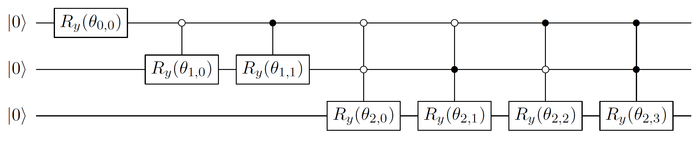

# Preparing states from classical data

## Rough overview (in words)

An important subroutine in many quantum algorithms is preparing a quantum state given a list of its amplitudes stored, for example, in a classical database.[^1] The upshot is that $N$ amplitudes, which require $\mathcal{O}\left( N \right)$ classical bits to write down, can be encoded in a quantum state with only $\log_2(N)$ qubits, an exponential compression in memory. However, there are caveats; for example, simple information-theoretic bounds [@plesch2011statePrepUniversal] dictate that the quantum circuit that prepares the $\log_2(N)$-qubit state must still have at least $\mathcal{O}\left( N \right)$ gates, so no exponential advantage in gate complexity is possible. Depending on which resource is being optimized, the best protocol for state preparation will look different and optimal state preparation methods are known for most choices of metric.

## Rough overview (in math)

Let $x = (x_0,\ldots,x_{N-1}) \in \mathbb{C}^N$ be a vector of $N$ complex numbers, and let $$\begin{equation} \label{eq:ket_psi_state_prep} \ket{\psi} = \frac{1}{\lVert x \rVert}\sum_{i=0}^{N-1} x_i \ket{i} \end{equation}$$ be the associated normalized quantum state, where $\lVert x \rVert$ denotes the standard Euclidean vector norm. Let $n=\log_2(N)$ denote the number of qubits of $\ket{\psi}$. The goal is to prepare the state $\ket{\psi}$ by applying a quantum circuit to the state $\ket{0}^{\otimes n}$, a problem studied extensively in previous literature. A common approach, originating in [@grover2002SuperposEffIntegrProbDistr], is to iterate through each of the $n$ qubits and perform a single-qubit rotation, with the angle of rotation determined by the setting of the previous qubits. The rotation on the first qubit creates the 1-qubit state $$\begin{equation} \left(\sqrt{\sum\nolimits_{i=0}^{N/2-1} |x_i|^2 }\right)\ket{0} + \left(\sqrt{\sum\nolimits_{i=N/2}^{N-1} |x_i|^2 }\right) \ket{1} \end{equation}$$ by performing a single-qubit rotation (about the $Y$ axis) on the state $\ket{0}$ by an appropriate angle. Next, a similar kind of single-qubit rotation is performed on the second qubit, where the angle of rotation is conditioned on whether the first qubit is $\ket{0}$ or $\ket{1}$. The $m$th rotation is by one of $2^{m-1}$ angles, depending on the setting of the first $m-1$ qubits. Thus, in total there are $1+2+\ldots+2^{n-1} = N-1$ total angles that might be used for single-qubit rotations. This sequence of operations prepares the state $\lVert x\rVert^{-1}\sum_{i=0}^{N-1}\lvert x_i \rvert \ket{i}$. To apply the phases, a single qubit rotation about the $Z$-axis by the appropriate angle is performed—the angle depends on the setting of all $n$ qubits, corresponding to the $N=2^n$ different phases that might be needed. Thus, the total number of angles that define the protocol is $2N-1$, exactly corresponding to the number of real parameters needed to describe the general state in Eq. $\eqref{eq:ket_psi_state_prep}$.

<figure markdown>
{#fig:StatePrepSequential}
<figcaption markdown>Figure 1: Simple quantum circuit to prepare an arbitrary state $\ket{\psi}$ with non-negative real coefficients on $n=3$ qubits. The gate $R_y(\theta)$ denotes a single-qubit rotation by angle $\theta$ about the $Y$ axis. The angles $\theta_{s,p}$ run from $s=0,1,\ldots,n-1$ and $p=0,1,\ldots,2^s-1$, for a total of $2^n-1$ angles, which can be calculated from the amplitudes $x_i$. To account for negative or complex coefficients, as many as $2^n$ additional controlled $R_z$ rotations would be needed. More sophisticated proposals can reduce the depth for ancilla-free constructions from $\mathcal{O}\left( 2^n \right)$ to $\mathcal{O}\left( 2^n/n \right)$ [@sun2021asymptotically].</figcaption>
</figure>

It remains to describe how the controlled single-qubit rotations are performed when there are many control bits and different angles for each setting of the control. Here, one has many choices and the exact method will depend on how one has access to the data in $x$ and what resource is being optimized. The most straightforward way is to iterate through each possible setting of the control bits and perform a multiply controlled rotation by a fixed angle for each in sequence. This approach requires $\mathcal{O}\left( N \right)$ gates spread over $\mathcal{O}\left( N \right)$ depth, as depicted in Fig. [1](#fig:StatePrepSequential){reference-type="ref" reference="fig:StatePrepSequential"}. When ancilla qubits are available, one can design protocols that have shallower depth (but the same total number of gates). For example, to perform the controlled rotation, one might store the $2N-1$ angles needed to create the state in a [quantum random access memory](../../quantum-algorithmic-primitives/loading-classical-data/quantum-random-access-memory.md#quantum-random-access-memory) data structure. In this case, to perform a rotation, one need only read in the value of the angle from the QRAM into an ancilla register, then perform a rotation by the angle stored in memory. This way, one can apply the correct angle in one shot, rather than iterating through all possible angles.

Assuming one can perform arbitrary single-qubit gates to exact precision, it is possible to prepare the state $\ket{\psi}$ exactly. However, often one must design circuits from a discrete gate set, such as Clifford gates and $T$ gates, for example, when compiling into a gate sequence that can be [implemented fault tolerantly](../../fault-tolerant-quantum-computation/logical-gates-with-the-surface-code.md#logical-gates-with-the-surface-code). When this is the case, single-qubit rotations must be performed approximately: to approximate a single-qubit rotation to error $\epsilon$, a Clifford+$T$ sequence of length $\mathcal{O}\left( \log(1/\epsilon) \right)$ must be applied [@ross2014optimal].

## Dominant resource cost (gates/qubits)

In the table below, we collect several state preparation results in the model where any single-qubit gate can be performed exactly and the only multi-qubit gates allowed are CNOTs. Each result is state-of-the-art in some parameter regime. The circuit size (i.e., the total number of single-qubit and CNOT gates) and depth (i.e., the number of parallel-acting layers of gates), as well as the number of ancilla qubits (i.e. the number of qubits beyond the $n$ qubits needed to hold the state $\ket{\psi}$) are listed.

<figure markdown>

|                                **Ref.**                                 |        **Circuit size**         |              **Circuit depth**              |             **Ancilla qubits**              |
| :-—–—--—–—--—–—--—–—--—–—--—–—--—–---: | :-—–—--—–—--—–---: | :-—–—--—–—--—–—--—–—--: | :-—–—--—–—--—–—--—–—--: |
|      [@sun2021asymptotically; @yuan2023optimalControlledStatePrep]      | $\mathcal{O}\left( 2^n \right)$ |  $\mathcal{O}\left( \frac{2^n}{n} \right)$  |                    none                     |
|      [@sun2021asymptotically; @yuan2023optimalControlledStatePrep]      | $\mathcal{O}\left( 2^n \right)$ | $\mathcal{O}\left( \frac{2^n}{m+n} \right)$ | $m \in [0,\mathcal{O}\left( 2^n/n \right)]$ |
| [@sun2021asymptotically; @zhang2022StatePrepOptimal; @gui2023spacetime] | $\mathcal{O}\left( 2^n \right)$ |        $\mathcal{O}\left( n \right)$        |       $\mathcal{O}\left( 2^n \right)$       |

</figure>

Note that the result of [@yuan2023optimalControlledStatePrep], which shows depth $\mathcal{O}\left( 2^n/(m+n) \right)$ using $m$ ancilla qubits for $m \leq \mathcal{O}\left( 2^n/n \right)$, encompasses all other results in the table (and is superior to the third row as it uses $\mathcal{O}\left( 2^n/n \right)$ ancilla qubits instead of $\mathcal{O}\left( 2^n \right)$). We include the other results for completeness, as they are distinct constructions and can have other potential upsides.

A lower bound of $\Omega(2^n)$ is known for circuit size [@plesch2011statePrepUniversal], so all of the results above are size optimal up to constant factors. Moreover, for any $m$, a lower bound of $\Omega(\max(n,2^n/(n+m)))$ is known for the circuit depth [@sun2021asymptotically], so all of the results above are also optimal in circuit depth, up to constant factors.

For approximate state preparation in a discrete gate set such as $\{H,S,T,\mathrm{CNOT}\}$, the state $\ket{\psi}$ is prepared up to $\epsilon$ error, measured by the $\ell_2$-norm, and the circuit size and depth will depend on $\epsilon$. In this case, we have the following table of results.

<figure markdown>

|         **Ref.**         |                  **Circuit size**                  |                       **Circuit depth**                       |                     **Ancilla qubits**                      |
| :-—–—--—–—---: | :-—–—--—–—--—–—--—–—--—–--: | :-—–—--—–—--—–—--—–—--—–—--—–---: | :-—–—--—–—--—–—--—–—--—–—--—–-: |
| [@sun2021asymptotically] | $\mathcal{O}\left( 2^n \log(2^n/\epsilon) \right)$ | $\mathcal{O}\left( \frac{2^n \log(2^n/\epsilon)}{n} \right)$  |                            none                             |
| [@sun2021asymptotically] | $\mathcal{O}\left( 2^n \log(2^n/\epsilon) \right)$ | $\mathcal{O}\left( \frac{2^n\log(2^n/\epsilon)}{m+n} \right)$ | $m \in [0,\mathcal{O}\left( \frac{2^n}{n \log(n)} \right)]$ |
|   [@gui2023spacetime]    |  $\mathcal{O}\left( 2^n\log(n/\epsilon) \right)$   |        $\mathcal{O}\left( n +\log(1/\epsilon) \right)$        |               $\mathcal{O}\left( 2^n \right)$               |

</figure>

If the state $\ket{\psi}$ is sparse, meaning that only $d$ of the $N$ amplitudes are nonzero, then more efficient state preparation methods are known. In particular, [@zhang2022StatePrepOptimal] gave a circuit of depth $\mathcal{O}\left( \log(nd) \right)$ that uses only $\mathcal{O}\left( nd\log(d) \right)$ ancilla qubits, a great improvement over the general case when $d \ll N$.

In some [fault-tolerant implementation schemes](../../fault-tolerant-quantum-computation/basics-of-fault-tolerance.md#basics-of-fault-tolerance), such as [lattice surgery using surface codes](../../fault-tolerant-quantum-computation/logical-gates-with-the-surface-code.md#logical-gates-with-the-surface-code), Clifford gates can be performed cheaply, while $T$ gates require the expensive process of magic state distillation. While $\Omega(2^n\log(1/\epsilon)/\log(n))$ total gates are necessary to approximately create $\ket{\psi}$ [@nielsen2002QCQI Eq. 4.85] (matching upper bounds from [@gui2023spacetime] up to $\mathrm{polylog}(n)$ factors), [@low2018tradingTgatesforDirtyQubits] noted that it is possible for most of these to be Clifford gates. The number of $T$ gates can be reduced to $\sqrt{2^n}\log(2^n/\epsilon)$ using $\sqrt{2^n}\log(1/\epsilon)$ ancillas (in fact, there is a smooth tradeoff between the $T$ count and the number of ancillas). Furthermore, these ancillas can be *dirty*, meaning they can be initialized into any quantum state, so long as they are returned to this (potentially unknown) state at the end of the procedure.

All of the above constructions are "garbage-free" state preparation protocols, because they prepare the state $\ket{\psi}$ exactly and all ancilla qubits are returned to their initial state. However, in some applications, it is allowable to leave the ancilla register entangled with the data as long as the coefficients are correct. That is, one prepares the state $$\begin{equation} \frac{1}{\lVert x\rVert}\sum_{i=0}^{N-1} x_i \ket{i} \otimes \ket{\mathrm{garbage}_i}\,. \end{equation}$$ In this setting, [@babbush2018EncodingElectronicSpectraLinearT Sec. IIID], en route to giving better algorithms for the [electronic structure problem](../../areas-of-application/quantum-chemistry/electronic-structure-problem.md#electronic-structure-problem), gave a construction that approximately prepares the state above using only $\mathcal{O}\left( 2^n+\log(1/\epsilon) \right)$ $T$ gates and $\mathcal{O}\left( \log(N) \right)$ ancilla qubits, albeit still requiring $\mathcal{O}\left( N\log(1/\epsilon) \right)$ Clifford gates and $\mathcal{O}\left( \log(N/\epsilon) \right)$ ancillas. In [@babbush2018EncodingElectronicSpectraLinearT] it is presented with $\mathcal{O}\left( N \right)$ depth but could be improved to $\mathcal{O}\left( \log(N) \right)$ depth at the expense of additional ancillas, using log-depth constructions for [QRAM](../../quantum-algorithmic-primitives/loading-classical-data/quantum-random-access-memory.md#quantum-random-access-memory). This method can also make use of the spacetime tradeoffs mentioned above, as discussed in [@low2018tradingTgatesforDirtyQubits; @Berry2019QubitizationOfArbitraryBasisChemistry].

## Caveats

- Classical pre-processing: computing the circuits for preparing $\ket{\psi}$ given the list of $N$ coefficients $x$ can be a non-negligible classical cost. For example, computing each of the $\mathcal{O}\left( N \right)$ single-qubit rotation angles requires computing sums and evaluating trigonometric functions, which can be done to precision $\epsilon$ in $\mathrm{polylog}(1/\epsilon)$ classical time. Moreover, computing Clifford+$T$ gate sequences that approximate given rotation angles to error $\epsilon$ likewise requires $\mathrm{polylog}(1/\epsilon)$ classical time [@ross2014optimal]. The total classical work scales as $O(N\mathrm{polylog}(1/\epsilon))$, although this cost can be parallelized.
- Coherent arithmetic: to avoid some of the classical pre-processing, one might try to perform the arithmetic coherently. This might be unavoidable if the entries of $x$ arrive in an online fashion and rotation angles and other quantities need to be computed after superpositions have been created. Formally, the scaling of coherent arithmetic is mild, generally requiring just $\mathrm{polylog}(N,1/\epsilon)$ number of gates and ancilla qubits, but in practice this is likely to be expensive (e.g., known methods for coherently computing $\arcsin(\cdot)$ to nine bits of precision use order-$10^4$ Toffoli gates and more than 100 ancilla qubits [@haner2018OptimizingQuantumArithmetic]). See [@sanders2019BlackBoxQuantumStatePreparation] for a general black-box approach that avoids coherent arithmetic.
- Too many ancilla qubits: achieving depths that scale logarithmically with $N$ requires $\mathcal{O}\left( N \right)$ ancilla qubits, which limits the size of $N$ that might be practical. This could be mitigated if it is possible to develop a large-scale hardware element specialized for performing the sort of circuits that arise in these protocols, similar to a [quantum random access memory](../../quantum-algorithmic-primitives/loading-classical-data/quantum-random-access-memory.md#quantum-random-access-memory).
- Long-range gates: achieving $\mathrm{polylog}(N)$ depth for state preparation requires $\mathcal{O}\left( N \right)$ ancilla qubits and $\mathcal{O}\left( N \right)$ gates, many of which act in parallel and on far-separated qubits. If spatial locality were imposed, it would likely be difficult to avoid $\mathcal{O}\left( N \right)$ overhead in depth.
- Dequantization: Consider the task of drawing samples from the same probability distribution induced by measuring $\ket{\psi}$ in the computational basis in time $\mathrm{polylog}(N)$ time. Preparing $\ket{\psi}$ as described is a quantum method of doing so, but the same can be done classically by first constructing a certain classical data structure and assuming access to classical RAM [@chakraborty2018BlockMatrixPowers]. In some [machine learning](../../areas-of-application/machine-learning-with-classical-data/introduction.md#machine-learning-with-classical-data) applications, this idea leads to classical algorithms that effectively dequantize quantum algorithms that utilize the state preparation primitive [@tang2018QuantumInspiredRecommSys; @tang2018QInspiredClassAlgPCA].

## Example use cases

- [Hamiltonian simulation](../../quantum-algorithmic-primitives/hamiltonian-simulation/taylor-and-dyson-series-linear-combination-of-unitaries.md#taylor-and-dyson-series-linear-combination-of-unitaries) via [linear combination of unitaries](../../quantum-algorithmic-primitives/quantum-linear-algebra/manipulating-block-encodings.md#linear-combinations) (LCU) requires a PREPARE step where a state is prepared with certain classically computed coefficients. Relatedly, the same PREPARE gadget is used to construct [block-encodings](../../quantum-algorithmic-primitives/quantum-linear-algebra/block-encodings.md#block-encodings) of such Hamiltonians. However, in this application, state preparation with garbage is generally allowable.
- In certain quantum [machine learning](../../areas-of-application/machine-learning-with-classical-data/introduction.md#machine-learning-with-classical-data) protocols, classical data (e.g., image pixel values) are encoded into a quantum state via the so-called "amplitude encoding," where $N$ classical features are stored in a quantum state of $\log_2(N)$ qubits [@schuld2021machineLearning]. Following the preparation of the amplitude encoded data, the state is processed with the goal of, for example, classifying the image.
- Creating a [block-encoding](../../quantum-algorithmic-primitives/quantum-linear-algebra/block-encodings.md#block-encodingsClassical) of a matrix of classical data is performed using state preparation as a subroutine (more precisely, block-encoding classical data requires controlled state preparation). The block-encoding is then useful in a variety of contexts, for example in [quantum interior point methods](../../quantum-algorithmic-primitives/quantum-interior-point-methods.md#quantum-interior-point-methods).

## Further reading

- When the amplitudes $x_i$ correspond to an efficiently computable function $f(i)$, the complexity of state preparation can be reduced. In this case, the oracle access to $x_i$ can be replaced by a reversible computation of $f(i)$, up to $t$ bits of precision, using coherent arithmetic $\ket{i}\ket{0^t} \rightarrow \ket{i}\ket{f(i)}$ [@haner2018OptimizingQuantumArithmetic; @bhaskar2015ReversibleArithmetic; @munoz2018SquareRoot]. The value of $f(i)$ can be *transduced* into the amplitude using the methods of [@grover2000SynthesisOfSuperpositions; @sanders2019BlackBoxQuantumStatePreparation; @wang2021BlackBoxLCU; @bausch2020BlackBoxState], and the success probability boosted to unity using [quantum amplitude amplification](../../quantum-algorithmic-primitives/amplitude-amplification-and-estimation/amplitude-amplification.md#amplitude-amplification). There is an alternative method [@mcardle2022StatePreparation], based on [quantum singular value transformation (QSVT)](../../quantum-algorithmic-primitives/quantum-linear-algebra/quantum-singular-value-transformation.md#quantum-singular-value-transformation) that circumvents the need for the coherent evaluation of $f(i)$ by implementing a low-cost [block-encoding](../../quantum-algorithmic-primitives/quantum-linear-algebra/block-encodings.md#block-encodings) of $\sin(i)$, and then using QSVT to apply $f(\arcsin(\cdot))$ to this block-encoding. The complexity of both of these approaches depends on an "L2-norm filling-fraction\" $\mathcal{F}_f^{[N]} := \nrm{f(i)}_2 / (\sqrt{N} |f(i)|_{\mathrm{max}})$ as $\mathcal{O}(1/\mathcal{F}_f^{[N]})$ (see [@mcardle2022StatePreparation] for more detail). There is also an approach [@rattew2022AdiabaticStatePrep] based on [the adiabatic algorithm](../../quantum-algorithmic-primitives/quantum-adiabatic-algorithm.md#quantum-adiabatic-algorithm) which has a worse dependence on $\mathcal{F}_f^{[N]}$. For efficiently integrable probability distributions, one can use the approach of [@grover2002SuperposEffIntegrProbDistr], which has complexity independent of $\mathcal{F}_f^{[N]}$. However, this approach requires coherent arithmetic to reversibly evaluate the integral of the desired function (when applied to functions for which an analytic expression for the integral is not available, this can nullify the quadratic speedup in [quantum Monte Carlo estimation](../../quantum-algorithmic-primitives/amplitude-amplification-and-estimation/amplitude-estimation.md#amplitude-estimation) [@herbert2021GroverRudolphNoSpeedup]). There also exist methods specialized for certain target states, such as Gaussians [@kitaev2008WavefunctionPreparing; @rattew2021GaussianStatePrep].
- A related problem asks to synthesize an arbitrary $2^n \times 2^n$ unitary. Without ancillas, this requires depth and size $\mathcal{O}\left( 4^n \right)$, for which there are upper [@mottonen2005decompositions] and lower [@shende2004minimalTwoQubitCNOTCircuits] bounds that match up to constant factors. With ancillas, it is an open question whether or not the depth can be reduced to $\mathrm{poly}(n)$; this is related to the "unitary synthesis problem" from the list of open problems in [@aaronson2021openProblems], and it has been studied in several works, e.g., [@sun2021asymptotically; @rosenthal2021queryBoundsUnitaries; @yuan2023optimalControlledStatePrep]. A depth lower bound of $\Omega(n + 4^n/(m+n))$ is known for $m$ ancilla qubits [@sun2021asymptotically], but the shallowest upper bound is depth $\mathcal{O}\left( n2^{n/2} \right)$, using $m=\mathcal{O}\left( 4^n/n \right)$ ancilla qubits [@yuan2023optimalControlledStatePrep]. 

[^1]: When the amplitudes are given by some well-behaved function, rather than being arbitrarily chosen, different (related) protocols are used, see [Further reading](#StatePrepData-further-reading) below.

