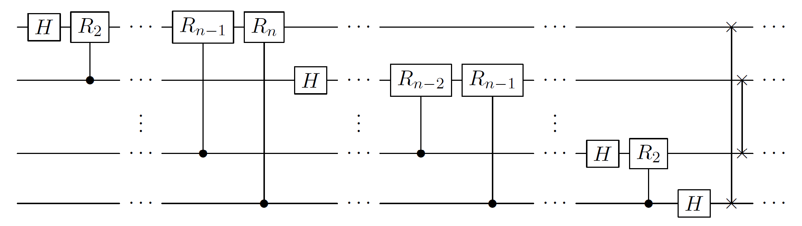

# Quantum Fourier transform

## Rough overview (in words)

The quantum Fourier transform (QFT) is a quantum version of the discrete Fourier transform (DFT) and takes quantum states to their Fourier transformed version.

## Rough overview (in math)

The QFT is a quantum circuit that takes pure $N$-dimensional quantum states $\ket{x}=\sum_{i=0}^{N-1}x_i\ket{i}$ to pure quantum states $\ket{y}=\sum_{i=0}^{N-1}y_i\ket{i}$ with the Fourier transformed amplitudes $$\begin{align} \label{eq:Fourier} y_k=\frac{1}{\sqrt{N}}\sum_{l=0}^{N-1}x_l\exp(2\pi ikl/N)\quad\text{for }k=0,\cdots,N-1. \end{align}$$

## Dominant resource cost (gates/qubits)

The space cost is $\mathcal{O}\left( \log(N) \right)$ qubits and the quantum complexity of the textbook algorithm is $\mathcal{O}\left( \log^2(N) \right)$. In terms of Hadamard gates, swap gates, and controlled phase shift gates $\ket{0}\bra{0}\otimes I + \ket{1}\bra{1}\otimes R_\ell$ with $$\begin{align} R_\ell=\begin{pmatrix} 1 & 0\\ 0 & \exp\left(2\pi i2^{-\ell}\right)\end{pmatrix}\,, \end{align}$$ the quantum circuit looks as follows [@nielsen2002QCQI Fig. 5.1], where $N=2^n$:  The swap gates at the end of the circuit are required to reverse the order of the output bits. The complexity can be improved to $$\begin{align} \mathcal{O}\left( \log(N)\log\left(\log(N)\epsilon^{-1}\right)+\log^2\left(\epsilon^{-1}\right) \right) \end{align}$$ when only asking for $\epsilon$-approximate solutions [@hales2000ImprovQFT]. Finite constants and compilation cost for fault-tolerant quantum architectures are also discussed in the literature. For example [@nam2020ApproxQFTgates] gives an implementation with $\mathcal{O}\left( \log(N)\log\log(N) \right)$ $T$-gates and estimates finite $T$-gate costs for different instance sizes.

## Caveats

- The QFT does not achieve the same task as the classical DFT that takes vectors $(x_0,\cdots,x_{N-1})\in\mathbb{C}^N$ to vectors $(y_0,\cdots,y_{N-1})\in\mathbb{C}^N$ with $y_k$ defined as in Eq. $\eqref{eq:Fourier}$. The DFT can be implemented via the fast Fourier transform in classical complexity $\mathcal{O}\left( N\log(N) \right)$, which is exponentially more costly than the quantum complexity $\mathcal{O}\left( \log^2(N) \right)$ of the QFT. However, for the QFT to achieve the same task as the DFT, pure state quantum [tomography](../quantum-algorithmic-primitives/quantum-tomography.md#quantum-tomography) would be required to read out and learn the Fourier-transformed amplitudes, which destroys any quantum speedup for the DFT.
- When QFT is employed in use cases, e.g., for factoring, one has to be careful in finite size instances when counting resources [@smolin2013OverQF], and for this a semi-classical version of the QFT can be more quantum resource efficient [@griffiths1996semiclassicalQFT].

## Example use cases

- Even though the QFT does not speedup the DFT, QFT is used as a subroutine in more involved quantum routines with large quantum speedup. Examples include quantum algorithms for the discrete logarithm problem, the hidden subgroup problem, the factoring problem, to name a few. QFT can be seen as the crucial quantum ingredient that allows for a super-polynomial end-to-end quantum speedup for these problems. We discuss this in the context of [quantum cryptanalysis](../areas-of-application/cryptanalysis/introduction.md#cryptanalysis).
- The QFT appears in the standard circuit for [quantum phase estimation](../quantum-algorithmic-primitives/quantum-phase-estimation.md#quantum-phase-estimation), where it is used to convert accrued phase estimation into a binary value that can be read out.
- The QFT is used for switching between the position and momentum bases in grid-based simulations of [quantum chemistry](../areas-of-application/quantum-chemistry/electronic-structure-problem.md#electronic-structure-problem) [@kassal2008QuantumSimChemicalDynamics] or [quantum field theories](../areas-of-application/nuclear-and-particle-physics/quantum-field-theories.md#quantum-field-theories) [@jordan2012QuantumFieldTheory].

## Further reading

- Textbook reference [@nielsen2002QCQI Chapter 5]
- Wikipedia article [*Quantum Fourier transform*](#https://en.wikipedia.org/wiki/Quantum_Fourier_transform)
- The quantum Fourier transform can be generalized to other groups. The version presented above is for the group $\mathbb{Z}/(2^n\mathbb{Z})$. Its implementation for other abelian groups as well as non-abelian groups is discussed in [@childs2010QAlgosForAlgebraicProblems] and the references therein. 

