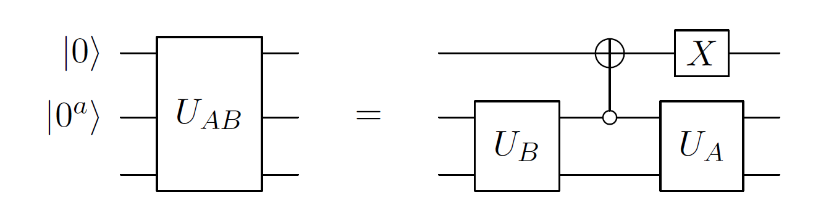
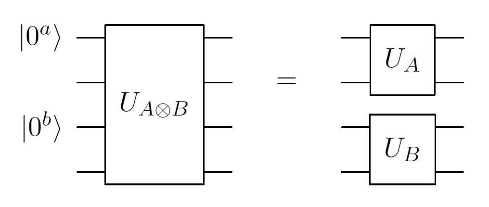
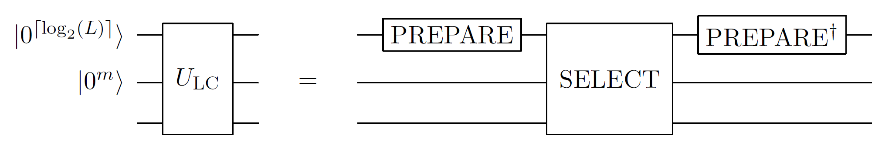

# Manipulating block-encodings

## Rough overview (in words)

Given one or more [block-encodings](../../quantum-algorithmic-primitives/quantum-linear-algebra/block-encodings.md#block-encodings), we often want to form a single block-encoding of a product, tensor product, or linear combination of the individual block-encoded operators. This can be achieved as outlined below, using additional ancilla qubits.

## Rough overview (in maths) and resource cost

We will consider the case of two operators $A$ and $B$, with straightforward generalizations to additional operators [@gilyen2018QSingValTransf]. We are given an $(\alpha, a, \epsilon_a)$-block-encoding $U_A$ of $A$, and a $(\beta, b, \epsilon_b)$-block-encoding $U_B$ of $B$. Operators $A$ and $B$ act on system qubits $s$.

### Products:

The operation $U_{AB} := (I_b \otimes U_A)(U_B \otimes I_a )$ is an $(\alpha \beta, a+b, \alpha \epsilon_b + \beta \epsilon_a)$-block-encoding of $AB$ [@gilyen2018QSingValTransf Lemma 53], where $I_x$ denotes the identity operator on $x$ qubits (see Fig. [1](#fig:BlockEncodeProduct){reference-type="ref" reference="fig:BlockEncodeProduct"}). For example, if $a=b$, this construction uses twice as many ancilla qubits for block-encoding the product compared to the block-encoding of the individual matrices. In fact we can assume without loss of generality that $a=b$ (by taking the max of the two) and improve the construction using the circuit in Fig. [2](#fig:BlockEncodeProduct2){reference-type="ref" reference="fig:BlockEncodeProduct2"}.

{#fig:BlockEncodeProduct}

{#fig:BlockEncodeProduct2}

### Tensor products:

The operation $U_{A \otimes B} := (U_A \otimes U_B)$ is an $(\alpha \beta, a+b, \alpha \epsilon_b + \beta \epsilon_a)$-block-encoding of the operator $A \otimes B$.

{#fig:BlockEncodeTensorProduct}

### Linear combinations:

Linear combinations of block-encodings can be viewed as a generalization of the linear combination of unitaries (LCU) trick [@childs2012HamSimLCU]. We wish to implement a block-encoding of $\sum_{i=0}^{L-1} c_i A_i$, where $c_i \in \mathbb{R}$ (the LCU trick can also be extended to complex coefficients) and define $\lambda := \sum_{i=0}^{L-1} |c_i|$. We consider $L$ block-encodings $U_i$ that are $(1, m, \epsilon_i)$-block-encodings of $A_i$. We note that in cases where the block-encodings have different $\alpha_i$ or $m_i$ values, the former can be absorbed into the $c_i$ values and the latter can be taken as $m = \max_i m_i$.

We first define an operator $\mathrm{PREPARE}$ by the following action on $\ket{0^{\lceil \log_2(L)\rceil}}$ $$\begin{equation} \mathrm{PREPARE} \ket{0^{\lceil \log_2(L)\rceil }} = \frac{1}{\sqrt{\lambda}} \sum_j \sqrt{|c_j|} \ket{j} \end{equation}$$ that prepares a weighted superposition on an ancilla register, such that the amplitudes are proportional to the square roots of the absolute values of the desired coefficients. We also define[^1] $$\begin{equation} \mathrm{SELECT} = \sum_{j=0}^{L-1} \ketbra{j}{j} \otimes \mathrm{sign}(c_j) U_j. \end{equation}$$ We then have the following result: $$\begin{align} \label{Eq:LCU} \left(\bra{0^{\lceil \log_2(L)\rceil}} \otimes I \right) \mathrm{PREPARE}^\dag \cdot \mathrm{SELECT} \cdot \mathrm{PREPARE} \left( \ket{0^{\lceil \log_2(L)\rceil}} \otimes I \right) & = \frac{1}{\lambda} \sum_{i=0}^{L-1} c_i U_i \end{align}$$ i.e. $U_{\mathrm{LC}} := \mathrm{PREPARE}^\dag \cdot \mathrm{SELECT} \cdot \mathrm{PREPARE}$ is a $(\lambda, \lceil \log_2(L)\rceil, 0)$-block-encoding of the LCU $\sum_i c_i U_i$. This is the standard LCU trick [@childs2012HamSimLCU], and it does not require $U_i$ to be block-encodings (or we can view them as $(1, 0, 0)$-block-encodings of themselves). This technique can be used in [Hamiltonian simulation](../../quantum-algorithmic-primitives/hamiltonian-simulation/taylor-and-dyson-series-linear-combination-of-unitaries.md#taylor-and-dyson-series-linear-combination-of-unitaries), or to instantiate a [block-encoding](../../quantum-algorithmic-primitives/quantum-linear-algebra/block-encodings.md#block-encodings).

If, as specified above, $U_i$ are block-encodings of $\tilde{A}_i$ (which approximate $A_i$), we also have the following result: $$\begin{equation} \left\lVert\left( \sum_i c_i A_i \right) - \lambda \left(\bra{0^{m+\lceil \log_2(L)\rceil}} \otimes I \right) U_{\mathrm{LC}} \left(\ket{0^{m + \lceil \log_2(L)\rceil}} \otimes I \right) \right\rVert \leq \sum_i |c_i|\epsilon_i. \end{equation}$$ Hence, $U_{\mathrm{LC}}$ is a $(\lambda, \lceil \log_2(L)\rceil + m, \lambda \max_i \epsilon_i)$ block-encoding of $\sum_i c_i A_i$.

<figure markdown>
{#fig:BlockEncodeLCU}
  <figcaption markdown>
Figure 4: Implementing the block-encoding $U_{\mathrm{LC}}$ of $\sum_i c_i A_i$ that acts on $s$ qubits. We require $\lceil \log_2(L)\rceil + m$ ancilla qubits. The regular LCU circuit is obtained by omitting the register $\ket{0^m}$ and the requirement that $U_i$ are block-encodings. The complexity of $\mathrm{PREPARE}$ depends on the coefficients $c_i$ but is $\Theta(L)$ in the worst case (using no additional ancilla qubits) [@plesch2011statePrepUniversal]. We can also define $\mathrm{PREPARE}$ that leads to entanglement with a garbage register $\mathrm{PREPARE} \ket{0^{\lceil \log_2(L)\rceil}} \ket{0^g} = \lambda^{-0.5} \sum_i \sqrt{|c_i|} \ket{i} \ket{G_i}$, which can be seen to satisfy the relations required to implement the linear combination, Eq. $\eqref{Eq:LCU}$. It can sometimes (e.g., [@babbush2018EncodingElectronicSpectraLinearT]) be cheaper to implement this garbage-entangled $\mathrm{PREPARE}$, see [preparing states from classical data](../../quantum-algorithmic-primitives/loading-classical-data/preparing-states-from-classical-data.md#preparing-states-from-classical-data). The cost of $\mathrm{SELECT}$ depends on the form of $U_i$, but in the worst case requires $\Theta(L)$ primitive gates and $\Theta(L)$ calls to $\ketbra{0}{0} \otimes I + \ketbra{1}{1} \otimes U_i$ [@childs2018towardsFirstQSimSpeedup; @babbush2018EncodingElectronicSpectraLinearT], although this can be improved in some relevant special cases (e.g., [@Wan2021exponentiallyfaster]).
  </figcaption>
</figure>

## Caveats

Performing linear algebraic manipulations of block-encodings using these primitives can quickly increase the ancilla count of the algorithm and worsen the normalization factor of the block-encoding. Amplifying a subnormalized block-encoding is possible, but costly, requiring an amount of time scaling roughly linearly in the amplification factor, see [@low2017HamSimUnifAmp; @gilyen2018QSingValTransf]. Given a single block-encoded operator $A$, the above primitives can be used to implement a block-encoding of a polynomial in $A$. However, this can be achieved with much lower overhead using [quantum singular value transformation](../../quantum-algorithmic-primitives/quantum-linear-algebra/quantum-singular-value-transformation.md#quantum-singular-value-transformation).

## Example use cases

- Linear combination of block-encodings are used to obtain mixed-parity functions in [QSVT](../../quantum-algorithmic-primitives/quantum-linear-algebra/quantum-singular-value-transformation.md#quantum-singular-value-transformation) required for [Hamiltonian simulation](../../quantum-algorithmic-primitives/quantum-linear-algebra/quantum-signal-processing.md#quantum-signal-processingqubitization).
- [LCU trick](../../quantum-algorithmic-primitives/quantum-linear-algebra/manipulating-block-encodings.md#linear-combinations) used for: [Hamiltonian simulation](../../quantum-algorithmic-primitives/hamiltonian-simulation/taylor-and-dyson-series-linear-combination-of-unitaries.md#taylor-and-dyson-series-linear-combination-of-unitaries), or to instantiate [block-encodings](../../quantum-algorithmic-primitives/quantum-linear-algebra/block-encodings.md#block-encodings) of [chemistry](../../areas-of-application/quantum-chemistry/electronic-structure-problem.md#electronic-structure-problem) or [condensed matter physics](../../areas-of-application/condensed-matter-physics/introduction.md#condensed-matter-physics) Hamiltonians (see, e.g., [@babbush2018EncodingElectronicSpectraLinearT; @Wan2021exponentiallyfaster]).

## Further reading

- References [@gilyen2018QSingValTransfThesis Section 3.3] and [@lin2022LectureNotes Section 7.3] contain a comprehensive discussion of manipulating block-encodings, including proofs of many of the results stated above. 

[^1]: To be precise for $j\notin\{0,1,\ldots,L-1\}$ we define $\mathrm{sign}(c_j) U_j:=I$.

