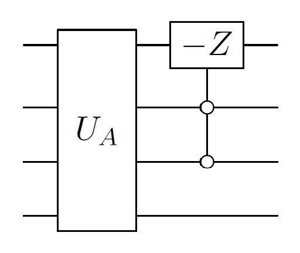

# Qubitization

## Rough overview (in words)

Qubitization has the following motivation: we are given a [block-encoding](../../quantum-algorithmic-primitives/quantum-linear-algebra/block-encodings.md#block-encodings) $U_A$ of a Hermitian operator $A$, and we wish to manipulate $A$—e.g., implement $A^2$, or more generally some function $f(A)$ [@low2016HamSimQubitization]. However, the eigenvalues of $U_A$ are typically unrelated to those of $A$, and plain repeated applications of $U_A$ do not in general produce the desired behavior. Qubitization converts the block-encoding $U_A$ into a unitary operator $W$ (sometimes called a qubiterate or a qubitized quantum walk operator) having the following guaranteed advantageous properties:

1. $W$ is a block-encoding of the operator $A$.
2. The spectrum of $W$ has a nice relation to the spectrum of $A$.
3. Repeated applications of $W$ leads to structured behavior that can be cleanly analyzed.

This combination of features means that qubitization can be used for applying polynomial transformations to the spectrum of $A$. For example, repeated application of $W$ implements Chebyshev polynomials of $A$, while other polynomials can also be implemented by using [quantum signal processing](../../quantum-algorithmic-primitives/quantum-linear-algebra/quantum-signal-processing.md#quantum-signal-processing) [@low2016HamSimQSignProc; @low2016HamSimQubitization; @gilyen2018QSingValTransf].

The key observation is that a qubitization unitary $W$ has eigenvalues and eigenvectors that relate in a nice way to those of $A$. Thus one can also perform [quantum phase estimation](../../quantum-algorithmic-primitives/quantum-phase-estimation.md#quantum-phase-estimation) on $W$ to learn these quantities [@poulin2018SpectralQubitization; @berry2018ImprovedEigenstatesFermionic], providing a potentially cheaper alternative to such tasks compared to approaches based on explicit [Hamiltonian simulation](../../quantum-algorithmic-primitives/hamiltonian-simulation/introduction.md#hamiltonian-simulation) for implementing $U=e^{iAt}$.

## Rough overview (in math)

We are given a $(1, m, 0)$-[block-encoding](../../quantum-algorithmic-primitives/quantum-linear-algebra/block-encodings.md#block-encodings) $U_A$ of Hermitian $A$ such that $$\begin{equation} A= \left(\bra{0^m} \otimes I \right) U_A \left(\ket{0^m} \otimes I \right)\Longleftrightarrow U_A = \left(\begin{array}{cc} A & \cdot \\ \cdot & \cdot \end{array}\right)\,, \end{equation}$$ where $\ket{0^m}$ denotes $\ket{0}^{\otimes m}$. First we will assume $U_A$ is also Hermitian (implying $U_A^2 = I$, where $I$ is the identity matrix). Let $A$ have spectral decomposition $A = \sum_\lambda \lambda \ketbra{\lambda}{\lambda}$. An application of $U_A$ to an eigenstate $\ket{\lambda}$ of $A$ gives $$\begin{equation} U_A \ket{0^m} \ket{\lambda} = \lambda \ket{0^m} \ket{\lambda} + \sqrt{1-\lambda^2} \ket{\perp_{0^m, \lambda}}, \end{equation}$$ where $\ket{\perp_{0^m, \lambda}}$ is a state perpendicular to $\ket{0^m}$.[^1] Noting $U_A^2=I$ reveals that the 2D subspace $S_\lambda$ spanned by $\{ \ket{0^m}\ket{\lambda}, \ket{\perp_{0^m, \lambda}} \}$ is invariant under the action of $U_A$. $U_A$ restricted onto $S_\lambda$ can be described by the matrix 
$$
\begin{aligned}
	\ket{0^m}\ket{\lambda}\ \ \ \ \  \  \   \ket{\perp_{0^m, \lambda}}\ \ \ \\
\begin{gathered}\ket{0^m}\ket{\lambda}\\
 \ket{\perp_{0^m, \lambda}}\end{gathered}
\begin{pmatrix} \lambda & \sqrt{1-\lambda^2} \\
\sqrt{1-\lambda^2} & -\lambda \end{pmatrix}
\end{aligned}
$$
which is a 2D reflection with eigenvalues $\pm 1$. Clearly, repeated application of (self-inverse) $U_A$ can have limited effect on any input state. Qubitization uses a reflection $Z_{\ket{0^m}} = (2\ketbra{0^m}{0^m} - I)$ to transform $U_A$ into a Grover-like operator $W = Z_{\ket{0^m}} U_A$ which has the following matrix when restricted onto the invariant subspace $S_\lambda$ in the $\{ \ket{0^m}\ket{\lambda}, \ket{\perp_{0^m, \lambda}} \}$ basis $$\begin{equation} _{ \{ \ket{0^m}\ket{\lambda}, \ket{\perp_{0^m, \lambda}} \} } = \left(\begin{array}{cc} 1 & 0 \\ 0 & -1 \end{array}\right) \left(\begin{array}{cc} \lambda & \sqrt{1-\lambda^2} \\ \sqrt{1-\lambda^2} & -\lambda \end{array}\right) = \left(\begin{array}{cc} \lambda & \sqrt{1-\lambda^2} \\ - \sqrt{1-\lambda^2} & \lambda \end{array}\right), \end{equation}$$ showing that $W$ is still a $(1, m, 0)$-block-encoding of $A$. This has the form of a $Y$-axis rotation $$\begin{equation} _{ \{ \ket{0^m}\ket{\lambda}, \ket{\perp_{0^m, \lambda}} \} }=\left(\begin{array}{cc} \cos(\theta_\lambda) & \sin(\theta_\lambda) \\ -\sin(\theta_\lambda) & \cos(\theta_\lambda) \end{array}\right), \end{equation}$$ where $\theta_\lambda = \arccos(\lambda)$. Therefore, $W$ has eigenvalues $e^{\pm i \arccos(\lambda)}$ with respective eigenvectors $\left(\ket{0^m} \ket{\lambda} \pm i \ket{\perp_{0^m, \lambda}} \right)/\sqrt{2}$, which can be accessed using [quantum phase estimation](../../quantum-algorithmic-primitives/quantum-phase-estimation.md#quantum-phase-estimation).

Furthermore, we can see that on the span of the subspaces $S_\lambda$ repeated application of $W$ acts as $$\begin{align} W^d & = \bigoplus_\lambda \left(\begin{array}{cc} \cos(d\theta_\lambda) & \sin(d\theta_\lambda) \\ -\sin(d\theta_\lambda) & \cos(d\theta_\lambda) \end{array}\right) \\
& = \bigoplus_\lambda\left(\begin{array}{cc} T_d(\lambda) & \sqrt{1-\lambda^2} U_{d-1}(\lambda) \\ -\sqrt{1-\lambda^2} U_{d-1}(\lambda) & T_d(\lambda) \end{array}\right) \\
& = \left(\begin{array}{cc} T_d(A) & \cdot \\ \cdot & \cdot \end{array}\right), \end{align}$$ where $T_d(\cdot)$ and $U_d(\cdot)$ are degree-$d$ Chebyshev polynomials of the first and second kind, respectively. Therefore, $W^d$ applies the polynomial transformation $T_d$ to each eigenvalue of $A$ thereby implementing $T_d(A)$.

## Dominant resource cost (gates/qubits)

The resource cost of qubitization is inherited from the cost of the block-encoding. Given a Hermitian $(\alpha, m, 0)$-block-encoding $U_A$, the qubitization operator $W$ is a (non-Hermitian) $(\alpha, m, 0)$-block-encoding, and it uses no additional qubits. The operation $Z_{\ket{0^m}} = (2\ketbra{0^m}{0^m} - I)$ can be implemented (up to global phase) with an $m$-qubit controlled $Z$ gate, equivalent to an $m$-qubit Toffoli up to single-qubit gates. An example qubitization circuit is shown below in Fig. [1](#fig:QubitizationCircuit){reference-type="ref" reference="fig:QubitizationCircuit"} for $m=3$. Implementing a block-encoding of a degree-$d$ Chebyshev polynomial applied to $A$ requires $d$ calls to $U_A$ and $Z_{\ket{0^m}}$.

{#fig:QubitizationCircuit}

If the block-encoding $U_A$ is not Hermitian, qubitization can be achieved using the construction of [@low2016HamSimQubitization Lemma 10] that uses one additional qubit and one call to controlled $U_A$ and controlled $U_A^\dag$ to implement the Hermitian block-encoding $$\begin{align} \label{eq:genQubitiz} U'_A:=((HX)\otimes I)(\ketbra{0}{0}\otimes U_A+\ketbra{1}{1}\otimes U_A^\dagger)(H\otimes I). \end{align}$$

An alternative to qubitization is based on [quantum singular value transformation](../../quantum-algorithmic-primitives/quantum-linear-algebra/quantum-singular-value-transformation.md#quantum-singular-value-transformation) that uses the sequence $Z_{\ket{0^m}} U_A^\dag Z_{\ket{0^m}} U_A$, analogous to the earlier $W^2$, acting as $$\begin{equation} \nonumber \left(\begin{array}{cc} \lambda & \sqrt{1-\lambda^2} \\ -\sqrt{1-\lambda^2} & \lambda \end{array}\right)^{\!\!2} \end{equation}$$ on a 2D subspace analogous to $S_\lambda$. The approach can be extended to odd-degree polynomials with a single additional application of $Z_{\ket{0^m}} U_A$ [@gilyen2018QSingValTransf]. The advantage of this approach is that it does not require $U_A$ to be Hermitian, thus there is no need for an additional qubit or calls to controlled $U_A^{\pm 1}$. This approach may be referred to as "quantum eigenvalue transformation" [@lin2022LectureNotes; @mcardle2022StatePreparation] as this is a special case of [quantum singular value transformation](../../quantum-algorithmic-primitives/quantum-linear-algebra/quantum-singular-value-transformation.md#quantum-singular-value-transformation) just applied to Hermitian $A$.

## Caveats

The original formulation of qubitization [@low2016HamSimQubitization] discussed above requires a Hermitian or normal block-encoded matrix $A$. The concept can be extended to general (non-square) matrices via [quantum singular value transformation](../../quantum-algorithmic-primitives/quantum-linear-algebra/quantum-singular-value-transformation.md#quantum-singular-value-transformation), providing a significant generalization, however in some cases quantum signal processing and its generalized versions [@haah2018ProdDecPerFuncQSignPRoc; @chao2020FindingAngleSequences] can exploit additional structure that comes for example from the extra symmetries of Hermitian block-encodings, leading to potential constant factor savings.[^2]

## Example use cases

- Some quantum algorithms in [quantum chemistry](../../areas-of-application/quantum-chemistry/electronic-structure-problem.md#electronic-structure-problem) that compute energies perform phase estimation on a qubitization operator $W$ implemented via calls to a block-encoding of the electronic structure Hamiltonian. This avoids the approximation error incurred when performing phase estimation on $e^{iHt}$, implemented via [Hamiltonian simulation](../../quantum-algorithmic-primitives/hamiltonian-simulation/introduction.md#hamiltonian-simulation) [@poulin2018SpectralQubitization; @berry2018ImprovedEigenstatesFermionic].
- Qubitization acts as a precursor to [quantum singular value transformation](../../quantum-algorithmic-primitives/quantum-linear-algebra/quantum-singular-value-transformation.md#quantum-singular-value-transformation), which extends the concept to general matrices and unifies it with quantum signal processing.

## Further reading

- Original introduction of qubitization [@low2016HamSimQubitization] and quantum singular value transformation [@gilyen2018QSingValTransf].
- A pedagogical overview of quantum signal processing, its lifting to quantum singular value transformation, and their applications [@martyn2021GrandUnificationQAlgs].
- Reference [@lin2022LectureNotes Chapters 7 & 8] provides an accessible derivation of qubitization and quantum singular value transformation. 

[^1]: If $\lambda=\pm 1$, then there is no need for $\ket{\perp_{0^m, \lambda}}$, and the subspace $S_\lambda$ becomes one dimensional.

[^2]: Consider for example Hamiltonian simulation, where QSVT separately implements $\sin(t H)$ and $\cos(t H)$ using a block-encoding $U_H$ of the Hamiltonian $H$, and applies a 3-step oblivious amplification procedure on top of linear combination of unitaries to implement $\exp( i t H)$ [@gilyen2018QSingValTransf]. Meanwhile, quantum signal processing implements $\exp( i t H)$ directly but requires an additional ancilla qubit and controlled access to a Hermitian block-encoding $U'_H$, which, when implemented via Eq. [\[eq:genQubitiz\]](#eq:genQubitiz){reference-type="eqref" reference="eq:genQubitiz"}, uses both controlled $U_H$ and $U_H^\dagger$ resulting in a factor of $\sim 4$ overhead. Altogether these considerations suggest that the QSVT-based approach might have a slightly better constant factor overhead, particularly when controlled $U_H$ is significantly more costly to implement than $U_H$. If $U_H$ is already Hermitian then quantum signal processing can have an improved complexity.

